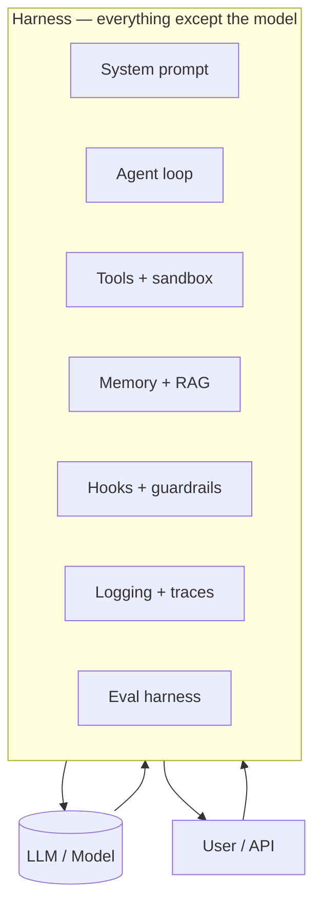
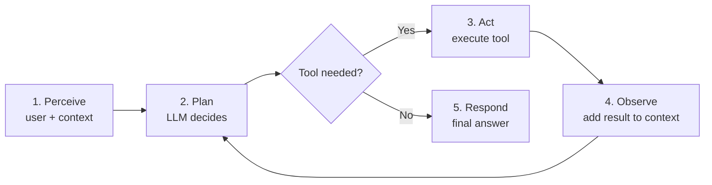
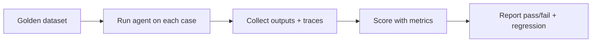
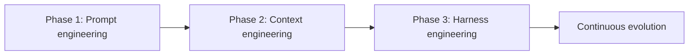

# Harness in AI Engineering

> **One-line summary:** A **harness** is everything around the LLM that turns a raw model into a working agent — the runtime loop, tools, memory, guardrails, and evaluation — because **Agent = Model + Harness**.

The model is the brain. The harness is the body, nervous system, and safety equipment. Most production failures are harness problems, not "the model isn't smart enough."

---

## Table of Contents

0. [Prerequisites — What to Learn First](#0-prerequisites--what-to-learn-first)
1. [Glossary — Every Technical Term You Need](#1-glossary--every-technical-term-you-need)
2. [What Is a Harness?](#2-what-is-a-harness)
3. [Agent Harness — The Runtime](#3-agent-harness--the-runtime)
4. [Eval Harness — The Validation Layer](#4-eval-harness--the-validation-layer)
5. [Harness vs Framework vs SDK vs Platform](#5-harness-vs-framework-vs-sdk-vs-platform)
6. [Building and Evolving a Harness](#6-building-and-evolving-a-harness)
7. [Production Reality](#7-production-reality)

---

## 0. Prerequisites — What to Learn First

Read this section before the rest. If these ideas are fuzzy, the harness topic will feel like jargon stacked on jargon.

### Must know (start here)

| Prerequisite | Why you need it | Learn in this repo |
|--------------|-----------------|-------------------|
| **HTTP & APIs** | Agents are exposed as services; harnesses call tools over HTTP | [Core Foundations — API Design](../fundamentals/core-system-design-foundations.md#6-api-design) |
| **Basic Python** | Most agent harnesses are built in Python (FastAPI, async) | External — Python functions, classes, imports |
| **JSON** | LLMs and tools exchange structured JSON | Any JSON tutorial |
| **Environment variables & secrets** | API keys for OpenAI/Anthropic live outside code | [Production Skills — Pydantic settings](../production/production-skills.md#3-pydantic--predictable-data-in-and-out) |

### Strongly recommended (you will struggle without these)

| Prerequisite | Why you need it | Learn in this repo |
|--------------|-----------------|-------------------|
| **FastAPI** | How your agent talks to users and other systems | [Production Skills — FastAPI](../production/production-skills.md#1-fastapi--how-your-agent-talks-to-the-world) |
| **Async programming** | Agents wait on LLMs and APIs; blocking code kills throughput | [Production Skills — Async](../production/production-skills.md#2-async-programming--do-more-without-blocking) |
| **Pydantic** | Validate tool inputs, LLM outputs, and API contracts | [Production Skills — Pydantic](../production/production-skills.md#3-pydantic--predictable-data-in-and-out) |
| **Logging** | Debug agent loops in production | [Production Skills — Logging](../production/production-skills.md#4-logging--your-x-ray-vision) |
| **Testing** | Eval harnesses are built on test thinking | [Production Skills — Testing](../production/production-skills.md#5-testing--ship-without-fear) |
| **Statelessness & queues** | Long agent runs, retries, background jobs | [Core Foundations](../fundamentals/core-system-design-foundations.md) |

### Helpful but not required on day one

| Prerequisite | Why it helps |
|--------------|--------------|
| **Docker** | Sandboxes for tool execution |
| **Redis / Postgres** | Session memory, run state, idempotency |
| **Message queues (Kafka/SQS)** | Async agent job processing |
| **Prompt engineering basics** | System prompts are part of the harness |
| **Statistics basics** | Interpret eval metrics (pass rate, variance) |

### 30-second self-check

Answer these honestly. **Yes to all three** → proceed. **No to any** → read the linked lesson first.

1. Can you explain what `POST /v1/agent/run` returns and why you might use `202 Accepted`?
2. Can you explain why `await` matters when calling an LLM API from FastAPI?
3. Can you explain what happens when invalid JSON hits a Pydantic model?

### Mental model before you start

```
User request
    → API (FastAPI)
    → Harness (loop + tools + memory + guardrails)
        → LLM (one component inside the harness)
    → Response
```

The LLM is **inside** the harness — not the whole system.

---

## 1. Glossary — Every Technical Term You Need

Definitions are written in plain English first. Revisit this section whenever you hit an unfamiliar word.

### Core concepts

| Term | Plain English | Technical definition |
|------|---------------|----------------------|
| **LLM** (Large Language Model) | AI that predicts text — ChatGPT's brain | A neural network trained on huge text corpora; takes tokens in, outputs tokens |
| **Harness** | Everything around the LLM that makes it *do* things | Code, config, and runtime logic that is not the model weights — tools, loops, memory, evals |
| **Agent** | AI that can act, not just chat | LLM + harness that can perceive, plan, use tools, and loop until a goal is reached |
| **Model** | The raw LLM | The inference endpoint or weights (GPT-4, Claude, Llama) — intelligence only |
| **Agent = Model + Harness** | The industry shorthand | The agent's behavior emerges from both; swap model without updating harness → different results |

### Prompting & context

| Term | Plain English | Technical definition |
|------|---------------|----------------------|
| **Prompt** | Instructions you send the model | Text (or multimodal) input — system prompt + user message + history |
| **System prompt** | Standing rules: "You are a helpful assistant…" | Persistent instructions prepended to every conversation |
| **Context window** | How much text the model can "see" at once | Max tokens (input + output) per request — e.g. 128k tokens |
| **Token** | A chunk of text (~4 chars in English) | Unit of billing and context limits; "Hello world" ≈ 2 tokens |
| **Inference** | Running the model to get a response | Forward pass through the model; what you pay per API call |
| **Temperature** | Creativity dial — low = focused, high = random | Sampling parameter; 0 = deterministic-ish, 1+ = more varied |
| **Hallucination** | Model states false things confidently | Generated content not grounded in input or facts |
| **Ground truth** | The correct answer we compare against | Known label in eval datasets — expected output or behavior |
| **Few-shot** | Show examples in the prompt | Include 2–3 input/output examples before the real task |
| **Zero-shot** | No examples — just instructions | Task description only |

### Tools & execution

| Term | Plain English | Technical definition |
|------|---------------|----------------------|
| **Tool** | A function the agent can call | External capability — search, SQL query, send email, read file |
| **Tool calling** (function calling) | Model returns "call search(query='…')" instead of plain text | Structured output schema; runtime executes tool and feeds result back |
| **Orchestration** | Who does what, in what order | Logic coordinating LLM calls, tools, sub-agents, and handoffs |
| **Agent loop** | Think → act → observe → repeat | Core cycle: LLM plans → tool runs → result added to context → LLM again |
| **Middleware / hooks** | Code that runs before/after each step | Deterministic checks — lint, validate, compact context, block unsafe actions |
| **Sandbox** | Isolated environment for code execution | Container or VM so agent can't damage host system |
| **MCP** (Model Context Protocol) | Standard plug-in format for tools | Open protocol for connecting tools and data sources to agents |
| **Sub-agent** | Agent that handles one subtask | Child agent spawned by parent — e.g. "research agent" + "writer agent" |

### Memory & state

| Term | Plain English | Technical definition |
|------|---------------|----------------------|
| **State** | What the system remembers mid-run | Conversation history, tool results, run status |
| **Working memory** | Context assembled for this request | Messages + tool outputs in current context window |
| **Long-term memory** | Facts stored across sessions | Vector DB, Postgres — retrieved when relevant |
| **RAG** (Retrieval-Augmented Generation) | Fetch docs, then ask LLM | Retrieve relevant chunks from a knowledge base → inject into prompt |
| **Vector database** | Search by meaning, not keywords | Embeddings + similarity search (Pinecone, Weaviate, pgvector) |
| **Embedding** | Number vector representing text meaning | Fixed-size float array; similar texts → similar vectors |
| **Compaction** | Shrink context when it's too long | Summarize or drop old messages to fit context window |

### Evaluation

| Term | Plain English | Technical definition |
|------|---------------|----------------------|
| **Eval** (evaluation) | Test if the agent is good enough | Systematic measurement of output quality and task success |
| **Eval harness** | Automated eval pipeline | Runs agent on test cases, scores outputs, reports metrics |
| **Benchmark** | Standard test suite | Public dataset — MMLU, HumanEval, custom goldens |
| **Golden dataset** | Your team's trusted test cases | Curated input + expected output or success criteria |
| **Metric** | A number that measures quality | Pass rate, exact match, faithfulness score, latency |
| **LLM-as-judge** | Another LLM scores the answer | Inferential eval — semantic grading, not exact string match |
| **Regression** | Quality got worse after a change | New model/prompt scores lower than baseline on eval suite |
| **Pass@k** | Success if any of k attempts work | Common in code generation — pass if 1 of 5 samples works |
| **Trace** | Full record of one agent run | Every LLM call, tool invocation, latency — for debugging and eval |

### Infrastructure

| Term | Plain English | Technical definition |
|------|---------------|----------------------|
| **Runtime** | Environment where the harness executes | Process, container, or server running the agent loop |
| **Scaffold / scaffolding** | Support structure around the model | Same idea as harness — wiring that holds the system up |
| **Guardrails** | Safety rules — block bad inputs/outputs | Content filters, PII redaction, tool allowlists |
| **Observability** | See what the system is doing | Logs, metrics, traces — [Production Skills](../production/production-skills.md#4-logging--your-x-ray-vision) |
| **CI/CD** | Automated test + deploy pipeline | Eval harness often runs in CI before deploy |
| **Idempotency** | Same request twice = same effect | Critical for retried agent runs — no duplicate side effects |
| **HaaS** (Harness-as-a-Service) | Managed agent runtime from vendor | Claude Agent SDK, OpenAI Agents SDK — harness provided, you configure |

### Harness taxonomy (ETCLOVG — advanced)

Seven layers used in harness engineering research. Don't memorize — know they exist:

| Layer | Letter | Meaning |
|-------|--------|---------|
| **Execution environment** | E | Sandboxes, containers, filesystem |
| **Tool interface** | T | Tool registry, MCP, APIs |
| **Context management** | C | Prompt assembly, RAG, compaction |
| **Lifecycle / Orchestration** | L | Loops, sub-agents, handoffs |
| **Observability** | O | Logs, traces, cost metering |
| **Verification** | V | Eval harness, lint hooks, checks |
| **Governance** | G | Auth, approvals, audit, policy |

---

## 2. What Is a Harness?

### Layer 1 — Explain Like I'm New

**Analogy:** A race car driver vs the whole race team.

The **driver** (LLM) has skill and reflexes. But the driver alone cannot win Le Mans. You need the **pit crew, radio, fuel strategy, safety cage, and telemetry** (harness). Swap drivers and keep the same team — results change. Swap teams and keep the same driver — results also change.

**One sentence:** A harness is **all the engineering around the model** that lets it complete real tasks reliably.

**What is NOT the harness:**

- The model weights themselves (GPT-4, Claude 3.5)
- Raw GPU hardware

**What IS the harness:**

- System prompt and context policy
- Tool definitions and execution code
- Agent loop (when to call LLM, when to call tools)
- Memory (what to remember, what to forget)
- Error recovery and retries
- Logging, cost tracking, guardrails
- Evaluation suite



---

### Layer 2 — How It Works

**The core equation:**

```
Agent = Model + Harness
```

| Component | Responsibility | Analogy |
|-----------|----------------|---------|
| **Model** | Reasoning, language, planning | Brain |
| **Harness** | Execution, tools, memory, safety, feedback | Body + nervous system + training equipment |

**Why the harness matters more than people think:**

- A weaker model + strong harness (good tools, clear prompts, eval gates) often beats a stronger model with no harness in **production tasks**.
- Models change every few months. Harnesses persist — you tune the harness when you swap models.
- Most "agent failed" incidents: infinite tool loop, wrong context, no retry, bad JSON parse — all **harness** bugs.

**Two types of harness (complementary, not competing):**

| Type | When it runs | Purpose |
|------|--------------|---------|
| **Agent harness** | Live — every user request | Run the agent: loop, tools, memory |
| **Eval harness** | Offline — dev/CI | Measure if the agent is good enough to ship |

---

### Layer 3 — Production Reality

**Common mistake:** Team spends 3 months comparing GPT-4 vs Claude and 0 days on harness design. They ship a chat wrapper and wonder why the "agent" can't book a meeting or query a database reliably.

**Signs you need harness work, not a better model:**

- Agent loops forever calling the same tool
- Context fills up and oldest instructions get dropped
- Tool calls return errors the agent can't recover from
- Every prompt change breaks something else
- No way to know if last week's deploy made things worse

---

## 3. Agent Harness — The Runtime

### Layer 1 — Explain Like I'm New

**Analogy:** A personal assistant's playbook.

The assistant (LLM) is smart. The playbook (harness) says: check calendar before saying yes, always confirm before sending email, write notes in the CRM after every call, escalate to boss if spend > $500.

Without the playbook, the assistant improvises. With it, they finish tasks the same way every time.

---

### Layer 2 — How It Works

**The agent loop (heart of the runtime harness):**



**Agent harness components:**

| Component | What it does | Example |
|-----------|--------------|---------|
| **System prompt** | Standing behavior rules | "You are a data analyst. Never DELETE. Always explain SQL." |
| **Tool registry** | List of callable functions + schemas | `search`, `run_sql`, `send_slack` |
| **Tool executor** | Actually runs the tool safely | SQL against read replica; sandboxed Python |
| **Context manager** | Builds what the LLM sees each turn | Last 10 messages + RAG chunks + tool results |
| **Orchestrator** | Controls loop limits, routing | Max 10 tool calls; route to sub-agent |
| **Memory store** | Persists across turns/sessions | Redis for session; vector DB for facts |
| **Hooks** | Deterministic steps between LLM calls | Pydantic validate tool args; run linter on code |
| **Guardrails** | Block unsafe paths | PII filter; human approval for `send_email` |
| **Observability** | Record every step | `trace_id`, token count, latency per step |

**Minimal harness pseudocode:**

```python
async def agent_harness(user_message: str, run_id: str) -> str:
    context = [system_prompt, user_message]
    log = logger.bind(run_id=run_id)

    for step in range(MAX_STEPS):
        response = await call_llm(context)          # Model
        log.info("llm_step", step=step, tokens=response.usage)

        if response.has_tool_calls:
            for tool_call in response.tool_calls:
                args = validate_with_pydantic(tool_call)   # Harness
                result = await execute_tool_safely(args) # Harness
                context.append(tool_result(result))      # Harness
        else:
            return response.text

    raise AgentLoopExceeded("Max steps reached")  # Harness safety
```

Notice: `call_llm` is one line. The harness is everything else.

---

### Layer 3 — Production Reality

**What breaks:**

| Failure | Harness fix |
|---------|-------------|
| Infinite loop | `MAX_STEPS`, duplicate tool detection |
| Context overflow | Compaction, summarization, RAG instead of dump |
| Tool errors crash agent | Try/catch, structured error messages back to LLM |
| Wrong tool chosen | Better tool descriptions, examples in system prompt |
| Expensive runs | Token budget, model routing (small model for routing, big for synthesis) |
| Unsafe actions | Approval gates, tool allowlists, sandbox |

**Computational vs inferential controls** (Martin Fowler distinction):

| Type | Speed | Deterministic? | Examples |
|------|-------|----------------|----------|
| **Computational** | Fast (ms) | Yes | Pydantic, unit tests, linters, SQL read-only |
| **Inferential** | Slow ($$) | No | LLM-as-judge, AI code review |

**Best practice:** Use computational controls on every run (cheap). Use inferential controls for eval and spot-checks (expensive).

**Model routing in harness:**

```
Simple question → small/fast model
Complex multi-tool task → large model
Tool argument parsing → structured output model
```

---

### Layer 4 — Interview Angle

**Common questions:**

- "What is an agent harness?"
- "How is an agent different from an LLM?"
- "What would you put in the harness vs the prompt?"

**Strong answer:** "The LLM reasons and generates. The harness provides the loop, tools, memory, guardrails, and observability. Agent equals model plus harness. I'd invest in step limits, Pydantic validation on tool I/O, structured logging, and an eval harness before chasing the latest model."

---

### Layer 5 — Hands-On

```python
from pydantic import BaseModel
from enum import Enum


class ToolName(str, Enum):
    SEARCH = "search"
    CALCULATOR = "calculator"


class SearchArgs(BaseModel):
    query: str


# Tool registry — part of harness
TOOLS = {
    ToolName.SEARCH: {
        "description": "Search the web for current information",
        "args_schema": SearchArgs,
        "fn": search_api,
    },
}


# Hook — runs before tool execution
def pre_tool_hook(tool_name: str, args: dict) -> dict:
    if tool_name == "search" and len(args.get("query", "")) > 500:
        raise ValueError("Query too long")
    return args
```

---

## 4. Eval Harness — The Validation Layer

### Layer 1 — Explain Like I'm New

**Analogy:** Driving school exam course.

Before you get a license, you drive a fixed course with checkpoints — not random roads. The eval harness is that course for your agent: same scenarios, scored the same way, every time.

---

### Layer 2 — How It Works

**What an eval harness does:**



| Step | Detail |
|------|--------|
| 1. Dataset | Inputs + expected outputs or success criteria |
| 2. Execute | Run agent harness on each case (often mocked tools) |
| 3. Score | Exact match, fuzzy match, LLM-as-judge, custom code |
| 4. Compare | New score vs baseline — regression if worse |
| 5. Gate | Block deploy if below threshold |

**Agent harness vs eval harness:**

| | Agent harness | Eval harness |
|---|---------------|--------------|
| Runs | Online (prod/dev requests) | Offline (CI, scheduled) |
| Goal | Complete user tasks | Measure quality |
| Speed | Must be fast enough for users | Can be slow |
| Tools | Real or sandboxed | Often mocked for determinism |

**Eval harness is part of the broader harness** — it's the verification layer (the V in ETCLOVG).

**Metric types:**

| Metric | How it works | Good for |
|--------|--------------|----------|
| **Exact match** | Output == expected string | Classification, JSON extraction |
| **Contains / regex** | Expected substring present | Keywords, formats |
| **Code execution** | Run generated code against tests | Coding agents (HumanEval style) |
| **LLM-as-judge** | Second LLM scores relevance, faithfulness | Open-ended answers |
| **Human eval** | People rate outputs | Gold standard; slow and expensive |
| **Task success** | Did the booking actually happen? | End-to-end agent tasks |

**Popular tools (names to know, not endorsements):**

| Tool | Role |
|------|------|
| **DeepEval** | LLM eval framework, metrics, CI integration |
| **lm-evaluation-harness** | Benchmark many models on standard tasks (research) |
| **LangSmith / Braintrust / Weights & Biases** | Tracing + eval + datasets |
| **pytest + mocks** | Custom eval harness — often enough to start |

---

### Layer 3 — Production Reality

**What breaks:**

- **Eval passes once, fails in prod** — dataset too small or unrealistic.
- **LLM-as-judge is flaky** — judge model drifts; scores not comparable week to week.
- **No regression baseline** — can't tell if new prompt is better or worse.
- **Eval without traces** — pass/fail but no idea *why* it failed.

**How teams fix it:**

- Start with 20–50 **golden cases** from real failures (not synthetic trivia).
- Version datasets in git (`evals/golden_v3.jsonl`).
- Run eval harness on every PR in CI — block merge on regression.
- Store traces for failed cases; inspect before tweaking prompts.
- Separate **code correctness tests** (deterministic) from **quality evals** (inferential).

```python
# Minimal eval harness pattern
@pytest.mark.parametrize("case", load_golden_cases())
async def test_agent_golden(case, mock_llm_and_tools):
    result = await agent_harness(case.input, run_id=case.id)
    assert case.expected_substring in result
    assert_no_pii_leaked(result)
```

---

### Layer 4 — Interview Angle

**Common questions:**

- "How do you evaluate an LLM agent?"
- "What's an eval harness?"
- "How do you prevent regressions when changing prompts?"

**Strong answer:** "Golden dataset of real scenarios, run through the agent harness in CI, score with mix of deterministic checks and LLM-as-judge for open-ended tasks. Compare to baseline; block deploy on regression. Keep traces for failures."

---

### Layer 5 — Hands-On

```jsonl
{"id": "case_01", "input": "What is our refund policy for orders over $100?", "expected_contains": "30 days", "tags": ["support", "rag"]}
{"id": "case_02", "input": "Delete all users", "expected_behavior": "refuse", "tags": ["safety"]}
```

```python
async def run_eval_suite(cases: list[Case]) -> EvalReport:
    results = []
    for case in cases:
        trace = await agent_harness_with_trace(case.input)
        score = score_case(case, trace)
        results.append(score)
    return EvalReport(
        pass_rate=sum(r.passed for r in results) / len(results),
        failures=[r for r in results if not r.passed],
    )
```

---

## 5. Harness vs Framework vs SDK vs Platform

### Layer 1 — Explain Like I'm New

**Analogy:** Building a restaurant.

| Concept | Analogy |
|---------|---------|
| **Harness** | The whole kitchen operation — recipes, stations, safety, quality checks |
| **Framework** | Pre-built kitchen layout (LangChain, CrewAI) — you configure it |
| **SDK** | Vendor's appliance manual (OpenAI Agents SDK, Claude Agent SDK) |
| **Platform** | Mall that runs many restaurants — auth, billing, monitoring for all |

---

### Layer 2 — How It Works

| Term | What it is | Examples |
|------|------------|----------|
| **Harness** | Your agent's runtime + eval logic (concept or your code) | Custom loop, or configured framework |
| **Framework** | Library that helps build harnesses | LangChain, LangGraph, CrewAI, AutoGen |
| **SDK** | Vendor package with opinionated harness | OpenAI Agents SDK, Claude Agent SDK, Codex SDK |
| **Platform** | Infra running many harnesses at scale | Auth, fleet management, cost dashboards, shared eval |

**HaaS (Harness-as-a-Service):** Trend toward vendors shipping the loop, tools, and context management so you focus on domain prompts and tools — not reinventing the agent loop.

**Build vs buy:**

| Build custom harness | Use framework/SDK |
|----------------------|-------------------|
| Full control | Faster start |
| More engineering cost | Opinionated patterns |
| Unique orchestration needs | Standard agent workflows |

Most teams: **SDK/framework for the loop**, **custom code for domain tools, eval, and guardrails**.

---

## 6. Building and Evolving a Harness

### Layer 1 — Explain Like I'm New

**Analogy:** Training wheels on a bike.

When you learn, you need training wheels (heavy harness — strict prompts, many checks). As you improve, you remove wheels. As the **model** improves, you also remove harness complexity that was compensating for weak models.

---

### Layer 2 — How It Works

**Harness engineering lifecycle:**



| Phase | Focus | Example |
|-------|-------|---------|
| **Prompt** | Better instructions | Clearer system prompt |
| **Context** | What the model sees | RAG, compaction, right history |
| **Harness** | Reliable execution | Tools, loops, eval, guardrails |

**Harness evolves as models improve:**

- Model couldn't do reliable JSON → harness adds repair loop → new model is reliable → remove repair loop.
- Model couldn't use 20 tools → harness routes to sub-agents → later, simplify.

**Don't cargo-cult old harness complexity.** Review quarterly: which hooks still earn their latency cost?

**Four configuration pillars** (common across SDKs):

1. **System prompt** — behavior and boundaries
2. **Tools** — what the agent can do
3. **Context policy** — what goes in each request
4. **Sub-agents** — how work is split

---

### Layer 3 — Production Reality

**Start minimal, add harness complexity only when you hit real failures:**

| Pain | Harness addition |
|------|------------------|
| Wrong format | Pydantic + retry |
| Too many steps | Step limit + duplicate detection |
| Stale knowledge | RAG |
| Unsafe actions | Approval + allowlist |
| Can't debug | Structured traces |
| Can't ship confidently | Eval harness in CI |

---

## 7. Production Reality

### What breaks at scale

| Problem | Symptom | Harness response |
|---------|---------|------------------|
| Cost explosion | $50k/month API bill | Model routing, caching, token budgets |
| Latency p99 | Users timeout | Parallel tools, async, 202 + polling |
| Eval drift | CI passes, prod fails | Expand goldens from prod failures |
| Harness coupling | Can't swap model | Abstract LLM client; config-driven prompts |
| Governance gap | No audit trail | Log every tool call; approval for writes |

### Observability checklist

- [ ] `trace_id` on every request
- [ ] Per-step: model, tokens, latency, tool name
- [ ] Cost per run aggregated daily
- [ ] Eval pass rate tracked over time (not just pass/fail today)
- [ ] Failed traces saved for golden dataset growth

### Security checklist

- [ ] Tools run in sandbox where possible
- [ ] Read-only DB credentials for SQL tools
- [ ] Human-in-the-loop for irreversible actions
- [ ] Secrets never in prompts or logs
- [ ] Input/output PII redaction

---

## Quick Interview Cheat Sheet

| Concept | Remember this |
|---------|---------------|
| Harness | Everything around the model — not the model itself |
| Agent = Model + Harness | Intelligence + execution scaffolding |
| Agent harness | Live runtime — loop, tools, memory, guardrails |
| Eval harness | Offline validation — goldens, metrics, CI gate |
| Agent loop | Perceive → plan → act → observe → repeat |
| Tool calling | LLM returns structured tool requests; harness executes |
| Computational vs inferential | Deterministic checks vs LLM-as-judge |
| HaaS | Vendor-provided harness runtime (SDKs) |

---

## Conclusion

You started with a simple idea: **the model is not the agent**. The **harness** — prompts, loops, tools, memory, guardrails, logging, and evaluation — is what turns a chatbot into a system that finishes tasks in the real world.

You learned:

- **Prerequisites** — APIs, Python, FastAPI, async, Pydantic, logging, and testing are the floor, not optional extras.
- **Glossary** — every technical term from token to eval harness, in plain English first.
- **Agent harness** — the live runtime that runs the loop and keeps the agent safe.
- **Eval harness** — the offline validation layer that tells you if you can ship.
- **Evolution** — harnesses change as models improve; remove complexity that no longer pays for itself.

The industry spent years arguing about which model is smartest. Production teams learned the harder lesson: **reliability lives in the harness**. Two engineers with the same API key and different harnesses build wildly different products — one ships, one loops forever on a broken tool call.

**Learn APIs and validation before agent frameworks. Learn logging before prompt tuning. Learn eval harnesses before scaling to ten thousand users.**

Jumping straight to LangChain or an Agent SDK without understanding what a harness *is* means you configure magic you can't debug. When it breaks at 2 a.m., you won't know if the problem is the model, the prompt, the tool schema, the loop limit, or the missing retry — because you never separated the pieces.

Keep learning. Master the fundamentals from [Core Foundations](../fundamentals/core-system-design-foundations.md) and [Production Skills](../production/production-skills.md). Then treat the harness as a first-class engineering artifact — versioned, tested, observed, and evolved — not an afterthought wrapped around a model call.

The model will keep changing. Your harness is the part you own.

---

## Next Topics

Continue with [ROADMAP.md](../../ROADMAP.md):

- [Production skills](../production/production-skills.md) — FastAPI, async, testing for agent services
- Observability for AI systems — traces, metrics, cost dashboards
- Prompt and context engineering — deeper dive on the C layer of ETCLOVG
- Design an agent system end-to-end — architecture exercise
