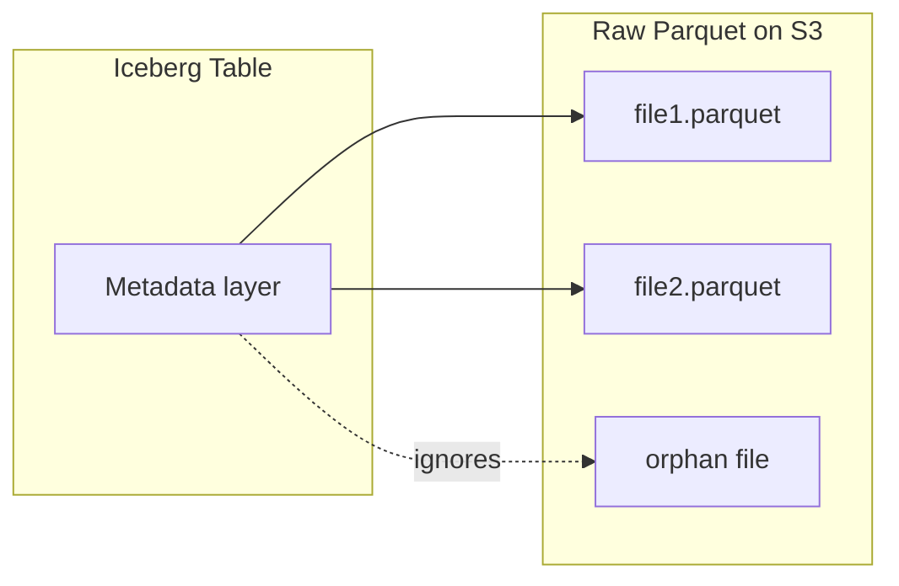
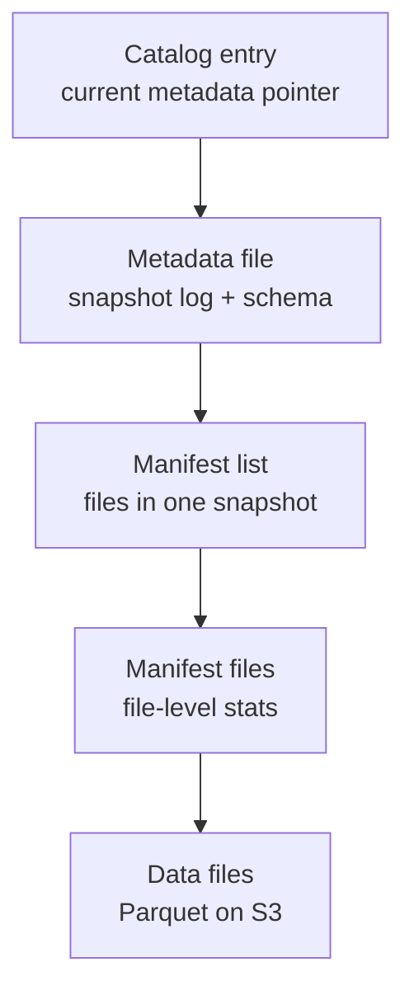
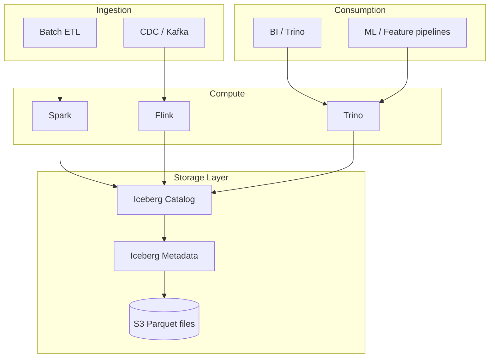

# Apache Iceberg for Data Engineers

> **One-line summary:** Apache Iceberg is an **open table format** for huge analytic datasets on object storage — it adds ACID transactions, time travel, and safe schema changes on top of Parquet files, without locking you into one query engine.

Iceberg is how modern **lakehouses** make S3/HDFS behave more like a database while staying cheap and open.

---

## Table of Contents

1. [What Problem Does Iceberg Solve?](#1-what-problem-does-iceberg-solve)
2. [What Iceberg Actually Is](#2-what-iceberg-actually-is)
3. [How Iceberg Works Internally](#3-how-iceberg-works-internally)
4. [Core Features Data Engineers Use Daily](#4-core-features-data-engineers-use-daily)
5. [Iceberg vs Delta Lake vs Hudi vs Hive](#5-iceberg-vs-delta-lake-vs-hudi-vs-hive)
6. [Catalogs, Engines, and the Lakehouse Stack](#6-catalogs-engines-and-the-lakehouse-stack)
7. [Operations: Compaction, Expire, and Maintenance](#7-operations-compaction-expire-and-maintenance)

---

## 1. What Problem Does Iceberg Solve?

### Layer 1 — Explain Like I'm New

**Analogy:** A library with no catalog system.

You have thousands of books (Parquet files) dumped in a warehouse (S3). To find "all mystery novels from 2023," you open every box, read every label, and hope nobody rearranged shelves while you were looking. If someone adds a book mid-search, your count might be wrong.

**One sentence:** Raw files on a data lake are hard to update safely, query efficiently, and keep consistent — Iceberg adds a **reliable catalog layer** on top of those files.

**Tiny example — life without Iceberg:**

```
s3://lake/orders/
  year=2023/month=06/part-00001.parquet
  year=2023/month=06/part-00002.parquet
  year=2024/month=01/part-00001.parquet   ← job failed mid-write, corrupt state
```

Questions you can't answer cleanly:
- Which files are **currently** part of the table?
- What did the table look like **yesterday**?
- Can two writers update the table **at the same time** without corrupting it?

Iceberg answers all three.



---

### Layer 2 — How It Works

**The pain points of "just Parquet on S3":**

| Problem | What goes wrong |
|---------|-----------------|
| No transactions | Job fails halfway → readers see partial data |
| Directory partitioning | `WHERE date = '2024-06-01'` still lists all folders |
| Schema changes | Add a column → old and new files incompatible silently |
| Concurrent writers | Two Spark jobs overwrite each other's metadata |
| Deletes/updates | Must rewrite entire files or hack around it |

**Iceberg's fix:** Treat the table as a **versioned set of files** managed by metadata, not as "whatever files happen to be in a folder."

---

### Layer 3 — Production Reality

Teams adopt Iceberg when:

- Multiple engines need the same table (Spark + Trino + Flink).
- They need **MERGE INTO**, **DELETE**, **UPDATE** on the lake.
- Finance or compliance asks: *"Reproduce the report exactly as it was on March 1."*
- Hive-style partition directories become unmaintainable at petabyte scale.

**When you might NOT need Iceberg yet:**

- Small datasets, single writer, append-only, one engine.
- You're already all-in on BigQuery/Snowflake native tables and not using open lake storage.

---

## 2. What Iceberg Actually Is

### Layer 1 — Explain Like I'm New

**Analogy:** MP3 is a file format; Spotify is the app. Iceberg is the **format** — not Spark, not S3, not the query engine.

**One sentence:** Iceberg is an **open table format specification** — a standard way to organize data files + metadata so any compatible engine can read and write the same table.

**What it is NOT:**

| Iceberg is | Iceberg is NOT |
|------------|----------------|
| A table format (like Parquet is a file format) | A database server |
| A metadata layer on object storage | A replacement for S3 |
| Engine-neutral (Spark, Flink, Trino, etc.) | Tied to one vendor |

**Tiny mental model:**

```
Query Engine (Spark / Trino / Flink)
        ↓
   Iceberg API
        ↓
   Catalog (Glue / Nessie / REST)
        ↓
   Metadata files (snapshots, manifests)
        ↓
   Data files (Parquet / ORC / Avro on S3)
```

---

### Layer 2 — How It Works

**Three layers:**

| Layer | Contents | Role |
|-------|----------|------|
| **Data files** | Parquet/ORC/Avro | Actual rows |
| **Metadata files** | Manifests, manifest lists, snapshots | Which files belong to which version |
| **Catalog** | Pointer to current metadata | How engines find the table |

**Table identifier:**

```
catalog_name.database_name.table_name
-- e.g. glue.prod.orders
```

The **catalog** stores the pointer to the latest metadata file. Engines resolve the table through the catalog, then read Iceberg metadata to know which data files to scan.

---

### Layer 3 — Production Reality

**Vendor momentum (as of 2024–2026):**

- AWS Glue, Databricks (UniForm), Snowflake (external tables), Apache Flink, Trino, Presto, ClickHouse — broad engine support.
- Netflix and Apple originated much of the design for scale.

**Lock-in risk is lower** than proprietary lake formats because the spec is Apache-licensed and engine-portable. Your files are still Parquet on S3 — Iceberg metadata is the portable contract.

---

## 3. How Iceberg Works Internally

### Layer 1 — Explain Like I'm New

**Analogy:** Git for your data table.

- **Commit** = snapshot (table at a point in time)
- **File list in that commit** = manifest
- **History of commits** = snapshot log

You can check out any past commit (time travel) without copying all the data.

---

### Layer 2 — How It Works

**Metadata hierarchy:**



| Component | Purpose |
|-----------|---------|
| **Snapshot** | Immutable table version — a consistent view of all data files at one moment |
| **Manifest list** | List of manifest files for one snapshot |
| **Manifest** | List of data files + per-file stats (row count, min/max column values) |
| **Metadata file** | Schema, partition spec, snapshot history, properties |

**Why manifests matter for performance:**

Each manifest file stores **column stats** (min/max/null count). The query engine reads manifests first and **skips entire files** that can't match your filter — without scanning Parquet.

Example: `WHERE order_date = '2024-06-01'` — if a file's `order_date` max is `2024-05-30`, Iceberg prunes it before touching Parquet.

**Copy-on-write vs merge-on-read (MOR):**

| Strategy | Write behavior | Read behavior |
|----------|----------------|---------------|
| **Copy-on-write (COW)** | Update/delete rewrites whole data files | Fast reads |
| **Merge-on-read (MOR)** | Writes delete markers + new rows | Faster writes, slower reads until compaction |

Most production batch workloads use COW. Streaming upserts often use MOR + periodic compaction.

---

### Layer 3 — Production Reality

**What breaks:**

- **Metadata bloat** — millions of tiny commits → slow planning. Fix: `expire_snapshots`, `rewrite_manifests`.
- **Small files** — thousands of 1 MB files → manifest overhead dominates. Fix: `rewrite_data_files` (compaction).
- **Snapshot explosion** — streaming micro-batches create a snapshot every minute. Fix: snapshot expiration policies + write batching.

**Optimistic concurrency:**

Two writers don't lock the table. Both try to commit; the second one fails if the base snapshot changed and retries. Under heavy concurrent writes, you see commit conflicts — tune retry logic or serialize writers per table.

**Observability:** snapshot count, data file count, average file size, metadata query time, commit failure rate.

---

### Layer 4 — Interview Angle

**Common questions:**

- "How does Iceberg achieve ACID on object storage?"
- "What is a snapshot?"
- "How does partition pruning work in Iceberg?"

**Strong answer:** "Iceberg commits are atomic metadata swaps. A snapshot is an immutable set of data files. Readers always use a single snapshot, so they never see partial writes. Manifests carry file-level stats for pruning without listing entire directories."

---

## 4. Core Features Data Engineers Use Daily

### Layer 1 — Explain Like I'm New

**Analogy:** A spreadsheet with version history, undo, and the ability to add columns without breaking old sheets.

---

### Layer 2 — How It Works

#### ACID Transactions

Writes produce a **new snapshot**. The catalog pointer switches atomically. Readers never see half-written data.

```
Writer A: snapshot 101 → 102  ✓
Writer B: based on 101 → conflict, retry from 102
Reader:   always reads exactly one snapshot (e.g. 102)
```

#### Time Travel

Query the table as it existed at a snapshot or timestamp:

```sql
-- Spark SQL
SELECT * FROM prod.orders TIMESTAMP AS OF '2024-06-01 00:00:00';
SELECT * FROM prod.orders VERSION AS OF 48291347;
```

Use cases: audit, reproduce a bug, backtest a model, compliance.

#### Schema Evolution

| Change | Supported | Notes |
|--------|-----------|-------|
| Add column | Yes | Existing files show NULL for new column |
| Drop column | Yes | Logical drop; old files retain column until rewritten |
| Rename column | Yes | Metadata mapping |
| Reorder columns | Yes | By name, not position |
| Change type | Limited | Safe promotions (int → long); risky casts need migration |

Iceberg tracks schema by **column ID**, not column index — so reordering doesn't break old files.

#### Partition Evolution

**Hive problem:** Partitioned by `days(order_date)`. Business wants monthly. Old data is stuck in daily folders.

**Iceberg solution:** Change partition spec for **new writes**; old data keeps old spec. Both coexist in one table. Queries still work.

#### Hidden Partitioning

Users write:

```sql
WHERE order_date = DATE '2024-06-01'
```

Iceberg applies the partition transform (`day(order_date)`) automatically. No need to know the physical layout `order_date_day=2024-06-01` in the path.

| Transform | Example use |
|-----------|-------------|
| `identity` | `country` as-is |
| `year`, `month`, `day` | Time filters |
| `bucket(N, col)` | Even spread of high-cardinality keys |
| `truncate(W, col)` | Group similar values |

---

### Layer 3 — Production Reality

**MERGE INTO (upserts) — the killer feature for CDC pipelines:**

```sql
MERGE INTO prod.orders AS target
USING staging.orders_updates AS source
ON target.order_id = source.order_id
WHEN MATCHED THEN UPDATE SET *
WHEN NOT MATCHED THEN INSERT *
```

This is how Debezium/Kafka CDC streams land in the lake with idempotent upserts.

**What breaks:**

- **Schema drift from source** — CDC adds columns; downstream MERGE fails. Fix: schema evolution policy + contract tests.
- **Time travel on expired snapshots** — you can't query what you deleted. Fix: retention policy aligned with compliance needs.
- **Wide schema evolution abuse** — 500 columns, most unused. Fix: governance.

---

### Layer 4 — Interview Angle

**Common questions:**

- "How would you implement CDC to a data lake?"
- "Explain hidden partitioning."
- "What's the difference between time travel and a backup?"

**CDC answer sketch:** Kafka → Flink/Spark streaming → Iceberg MERGE on primary key → compaction job on schedule → expire old snapshots per retention policy.

**Follow-up:** "Exactly-once?" — Iceberg + Flink two-phase commit or Spark structured streaming checkpoint + idempotent MERGE. End-to-end exactly-once is hard; at-least-once + idempotent MERGE is the production default.

---

### Layer 5 — Hands-On

```sql
-- Create table (Spark SQL)
CREATE TABLE glue.prod.orders (
    order_id    BIGINT,
    customer_id BIGINT,
    order_date  DATE,
    amount      DECIMAL(12,2)
)
USING iceberg
PARTITIONED BY (months(order_date))
TBLPROPERTIES ('format-version' = '2');
```

```sql
-- Time travel
SELECT COUNT(*) FROM glue.prod.orders VERSION AS OF 42;
SELECT * FROM glue.prod.orders TIMESTAMP AS OF '2024-06-01 08:00:00' LIMIT 10;
```

```sql
-- Schema evolution
ALTER TABLE glue.prod.orders ADD COLUMN discount DECIMAL(5,2);
ALTER TABLE glue.prod.orders RENAME COLUMN amount TO total_amount;
```

```sql
-- Incremental read (streaming)
-- Spark Structured Streaming: read stream from Iceberg table
-- Flink: Iceberg source with start snapshot / timestamp
```

```python
# PySpark — read Iceberg table
df = spark.read.format("iceberg").load("glue.prod.orders")

# Write append
df.writeTo("glue.prod.orders").append()

# Overwrite one partition
(
    df.filter("order_date = '2024-06-01'")
    .writeTo("glue.prod.orders")
    .overwritePartitions()
)
```

```sql
-- Maintenance (Spark procedures or engine-specific syntax)
CALL glue.system.rewrite_data_files('prod.orders');      -- compact small files
CALL glue.system.expire_snapshots('prod.orders',          -- drop old history
  TIMESTAMP '2024-01-01 00:00:00');
CALL glue.system.remove_orphan_files('prod.orders');     -- clean failed writes
```

---

## 5. Iceberg vs Delta Lake vs Hudi vs Hive

### Layer 1 — Explain Like I'm New

**Analogy:** Four different catalog systems for the same warehouse of boxes. All solve "manage files on cheap storage," but with different strengths and ecosystems.

---

### Layer 2 — How It Works

| | **Iceberg** | **Delta Lake** | **Hudi** | **Hive** |
|---|-------------|----------------|----------|----------|
| Origin | Netflix / Apple | Databricks | Uber | Apache Hadoop era |
| Open spec | Apache, engine-neutral | Linux Foundation; Databricks-led | Apache | Legacy |
| ACID | Yes (snapshot) | Yes (transaction log) | Yes | Limited |
| Time travel | Yes | Yes | Yes | No |
| Hidden partitioning | Yes | Limited | Varies | No (path-based) |
| Partition evolution | Yes | Limited | Yes | Painful |
| Engine support | Spark, Flink, Trino, Presto, etc. | Spark-first; growing | Spark, Flink | Hive, Spark |
| Best default for | Multi-engine lakehouse | Databricks shops | Heavy upsert/CDC streaming | Legacy migrations only |

**No universal winner.** Pick based on:

| Your situation | Lean toward |
|----------------|-------------|
| Multi-engine (Spark + Trino + Flink) | Iceberg |
| All-in on Databricks | Delta (or UniForm bridging to Iceberg) |
| Uber-scale mutable streaming tables | Hudi |
| Greenfield open lakehouse | Iceberg |
| Existing Hive tables | Migrate to Iceberg via migration tools |

---

### Layer 3 — Production Reality

**Interoperability trend:** Databricks UniForm, Snowflake external Iceberg tables, AWS Glue as catalog — convergence around Iceberg for open storage.

**Migration path from Hive:**

```sql
-- Spark: migrate Hive table to Iceberg in place (simplified)
CALL catalog.system.migrate('db.hive_orders');
```

Plan for: snapshot after migration, validate row counts, rerun compaction, update downstream jobs.

**Don't format-shop forever.** The cost of running two formats on the same data is worse than picking one and maintaining it well.

---

### Layer 4 — Interview Angle

**Common question:** "Iceberg vs Delta Lake?"

**Strong answer:** "Both add ACID and time travel on object storage. Iceberg is more engine-neutral with stronger partition evolution and hidden partitioning. Delta is mature in the Databricks ecosystem. I'd pick Iceberg for an open multi-engine lakehouse; Delta if the org is Databricks-native unless UniForm bridges the gap."

---

## 6. Catalogs, Engines, and the Lakehouse Stack

### Layer 1 — Explain Like I'm New

**Analogy:** The table of contents that tells every reader (engine) where to find the latest chapter (metadata file).

Without a catalog, engines guess paths. With a catalog, everyone agrees on `glue.prod.orders` → current metadata location.

---

### Layer 2 — How It Works

**Common catalogs:**

| Catalog | Where it runs | Typical use |
|---------|---------------|-------------|
| **AWS Glue** | Managed AWS | S3 lake on AWS |
| **Hive Metastore** | Self-hosted / EMR | Legacy, migrating |
| **Nessie** | Git-like catalog | Branching dev/prod tables |
| **REST Catalog** | Spec-based HTTP API | Vendor-neutral, custom |
| **Polaris / Gravitino** | Open catalog projects | Emerging multi-engine governance |

**Typical lakehouse stack:**



**Nessie branching (advanced):**

Like git branches for tables — experiment on `dev.orders`, merge to `main.orders`. Useful for isolated testing without copying petabytes.

---

### Layer 3 — Production Reality

**Catalog is the governance choke point:** IAM policies, table ACLs, and audit logs live here. Lose catalog access = lose the table even if S3 files exist.

**Cross-account / cross-region:** replicate data files + sync catalog metadata, or use S3 replication with careful consistency ordering.

**Observability:** Glue/Metastore API latency, failed commits, tables with >10k snapshots, orphan file ratio.

---

## 7. Operations: Compaction, Expire, and Maintenance

### Layer 1 — Explain Like I'm New

**Analogy:** A closet that needs seasonal cleaning.

New clothes (micro-batch files) pile up. Old outfits you never wear (expired snapshots) take space. Once a month, you consolidate and donate.

---

### Layer 2 — How It Works

| Operation | What it does | When to run |
|-----------|--------------|-------------|
| **Compaction** (`rewrite_data_files`) | Merge small files into larger ones | Daily/weekly; after streaming ingest |
| **Expire snapshots** | Remove old metadata versions | Per retention policy (30–90 days) |
| **Remove orphan files** | Delete files not referenced by any snapshot | After failed jobs; carefully |
| **Rewrite manifests** | Optimize manifest layout | When planning slows |

**Target file size:** Often 256 MB – 1 GB for Parquet on S3 (tune per query pattern).

**Retention trade-off:**

| Long retention | Short retention |
|----------------|-----------------|
| Longer time travel window | Less metadata storage |
| Audit/compliance friendly | Faster planning |
| Higher storage cost for old snapshots | Can't reproduce old state |

---

### Layer 3 — Production Reality

**Automate maintenance.** Tables that never get compacted become slow and expensive — not because Iceberg failed, but because ops weren't scheduled.

Typical Airflow/dbt job:

```
Sunday 02:00  → rewrite_data_files (all tier-1 tables)
Sunday 03:00  → expire_snapshots (retain 60 days)
Sunday 04:00  → remove_orphan_files (with dry-run first)
```

**What breaks:**

- **Aggressive orphan cleanup** — deletes files from a still-running write. Use age thresholds.
- **Compaction during peak** — IO contention. Schedule off-peak.
- **Expired snapshot + active time-travel query** — query fails. Align BI tooling with retention.

---

### Layer 5 — Hands-On

```python
# PySpark maintenance job (conceptual)
spark.sql("""
    CALL glue.system.rewrite_data_files(
        table => 'prod.orders',
        options => map('min-file-size-bytes', '134217728',
                       'target-file-size-bytes', '536870912')
    )
""")
```

```sql
-- Check table health (Spark)
SELECT * FROM glue.prod.orders.files;       -- data files + sizes
SELECT * FROM glue.prod.orders.snapshots;   -- snapshot history
SELECT * FROM glue.prod.orders.partitions;  -- partition stats
```

---

## Quick Interview Cheat Sheet

| Concept | Remember this |
|---------|---------------|
| What Iceberg is | Open **table format** on object storage — not an engine |
| Snapshot | Immutable table version; basis for ACID + time travel |
| Manifest | Per-file stats for pruning without full scans |
| Hidden partitioning | Filter on column; engine applies transform |
| Schema evolution | Column IDs, not positions — safe adds/renames |
| MERGE INTO | Upserts for CDC pipelines |
| Maintenance | Compact, expire snapshots, remove orphans — automate it |
| vs Delta | Iceberg = multi-engine open; Delta = Databricks-native strength |

---

## Conclusion

Apache Iceberg is not magic storage — it is **disciplined metadata** on top of cheap Parquet files. It exists because data lakes without a table format eventually break: partial writes, irreproducible reports, partition folder sprawl, and schema changes that silently corrupt joins.

You covered what matters for data engineers:

- **Why** — raw files on S3 are not enough for ACID, time travel, or safe evolution.
- **What** — an open table format: catalog + metadata + data files.
- **How** — snapshots, manifests, optimistic concurrency, hidden partitioning.
- **Daily use** — MERGE for CDC, schema/partition evolution, time travel for audit.
- **Ops** — compaction and snapshot expiration are not optional; they are part of the product.

Iceberg sits on top of fundamentals you should already know: **object storage** (S3), **columnar files** (Parquet), **grain and schema contracts** from data modeling, and **at-least-once + idempotent writes** from pipeline design. If you jump straight into Iceberg without understanding why lakes needed a format, you'll configure Spark jobs that write tables nobody can maintain — thousands of small files, expired snapshots breaking audits, and MERGE jobs that fight each other on commit.

**Learn Parquet and partitioning before Iceberg. Learn data modeling before MERGE INTO. Learn pipeline idempotency before CDC.**

The lakehouse hype will fade. Open table formats are the durable layer — the contract between storage, compute, and governance. Whether your next role uses Glue + Spark, Flink + Nessie, or Trino on Kubernetes, the mental model in this lesson transfers: **atomic snapshots, explicit file sets, automated maintenance.**

Keep learning. Master the fundamentals, then Iceberg becomes a tool you operate with confidence — not a black box you cargo-cult from Stack Overflow.

---

## Next Topics

Continue with [ROADMAP.md](../../ROADMAP.md):

- [Data modeling concepts](data-modeling-concepts.md) — grain and schema contracts Iceberg depends on
- Batch vs streaming — when Flink + Iceberg beats batch Spark
- ETL / ELT pipelines — orchestration around lakehouse writes
- Design a data lake / lakehouse — end-to-end architecture exercise
