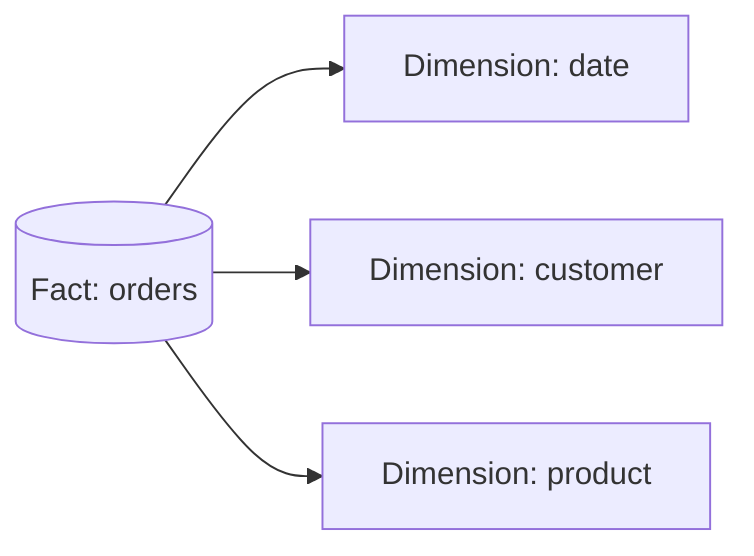
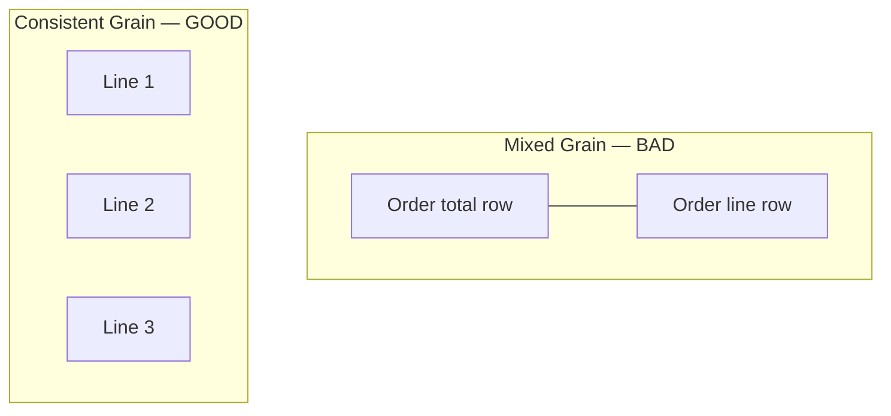
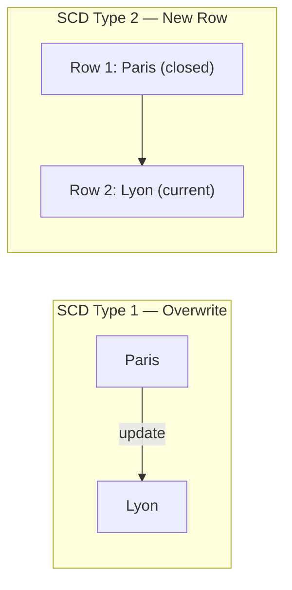
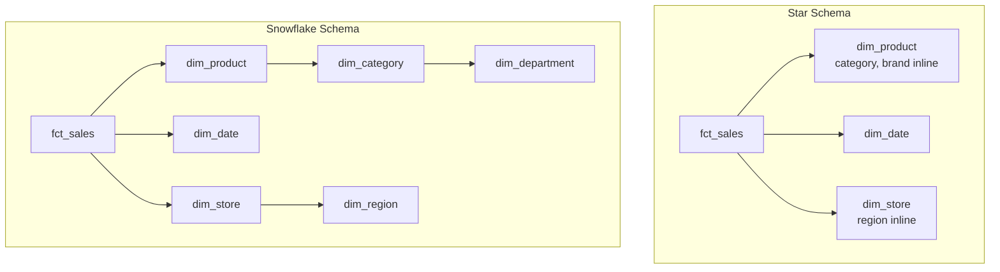
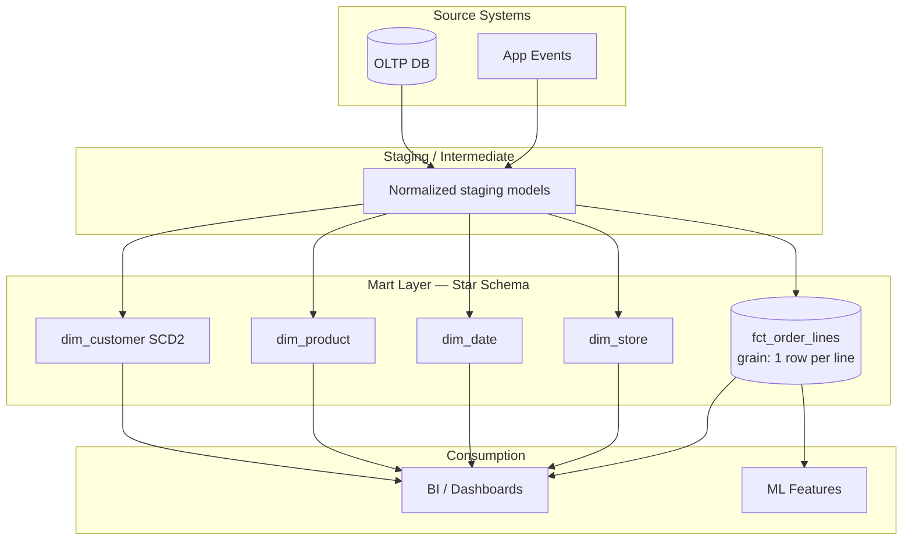

# Data Modeling Concepts

> **One-line summary:** Analytics data is organized around **facts** (measurable events) and **dimensions** (descriptive context), at a clearly defined **grain**, with rules for how history changes (SCDs) — usually in a **star** or **snowflake** schema.

If you understand fact tables, dimensions, grain, and slowly changing dimensions, you can read almost any warehouse, dbt project, or BI dashboard and know *why* it was built that way.

---

## Table of Contents

1. [Fact Tables](#1-fact-tables)
2. [Dimension Tables](#2-dimension-tables)
3. [Grain](#3-grain)
4. [Slowly Changing Dimensions (SCD)](#4-slowly-changing-dimensions-scd)
5. [Star Schema vs Snowflake Schema](#5-star-schema-vs-snowflake-schema)
6. [How It All Fits Together](#6-how-it-all-fits-together)

---

## 1. Fact Tables

### Layer 1 — Explain Like I'm New

**Analogy:** A cash register receipt.

Each line records *what happened*: you bought 2 coffees for $6.00 on Tuesday. The receipt doesn't explain what "coffee" means in detail — it just records the event and the numbers.

**One sentence:** A fact table stores **measurable business events** — usually numbers (amounts, counts, quantities) linked to keys that point to dimension tables.

**Tiny example:**

| order_id | date_key | customer_key | product_key | quantity | revenue |
|----------|----------|--------------|-------------|----------|---------|
| 9001 | 20240622 | 42 | 7 | 2 | 6.00 |
| 9002 | 20240622 | 88 | 3 | 1 | 14.50 |

Each row = one business event at a defined level of detail.



---

### Layer 2 — How It Works

**Facts hold metrics. Dimensions hold context.**

| Column type | Role | Examples |
|-------------|------|----------|
| **Foreign keys** | Link to dimensions | `date_key`, `customer_key`, `store_key` |
| **Measures (additive)** | Can be summed across rows | `revenue`, `quantity`, `clicks` |
| **Measures (semi-additive)** | Sum only across some dimensions | `account_balance` (don't sum across time) |
| **Measures (non-additive)** | Ratios — don't sum raw | `conversion_rate`, `margin_pct` |
| **Degenerate dimensions** | Descriptive IDs stored in the fact | `order_id`, `invoice_number` |

**Types of fact tables:**

| Type | Grain | Example |
|------|-------|---------|
| **Transaction** | One row per event | Each order line, each click |
| **Periodic snapshot** | One row per entity per time period | Daily account balance |
| **Accumulating snapshot** | One row per lifecycle, updated over time | Order: placed → shipped → delivered |
| **Factless** | No measure, just keys | Student attended class (presence only) |

**Why surrogate keys?** Use `customer_key = 1042` instead of natural ID `email@example.com`. Natural IDs change, merge, or contain PII. Surrogate keys are stable join targets.

---

### Layer 3 — Production Reality

**What breaks:**

- **Wrong grain** — two rows for the same event → double-counted revenue in dashboards.
- **Nullable foreign keys** — `customer_key = NULL` silently drops rows from joins or creates orphan facts.
- **Mixing grains** — one fact table with both order-level and line-item-level rows. Aggregations lie.
- **Huge wide facts** — 200 columns, most unused; scans get expensive.

**How teams fix it:**

- Document grain in the model (`schema.yml` in dbt: `grain: one row per order line`).
- Add **data tests**: `unique`, `not_null` on grain columns.
- Split facts when grains differ (`fct_orders` vs `fct_order_lines`).
- Use **partitioning** on `date_key` in BigQuery/Snowflake for pruning.

**Observability:** Row count anomalies, null FK rate, revenue reconciliation vs source system.

---

### Layer 4 — Interview Angle

**Common questions:**

- "What is a fact table?"
- "What's the difference between additive and semi-additive measures?"
- "Design a fact table for e-commerce orders."

**Strong answer:** "A fact table stores business events at a declared grain. Keys point to dimensions; columns hold numeric measures. I'd define grain first — one row per order line — then choose surrogate keys and partition by date for query performance."

**Follow-up:** "Degenerate dimension?" — A descriptive attribute (like `order_id`) stored in the fact because it doesn't warrant its own dimension table.

---

### Layer 5 — Hands-On

```sql
-- Transaction fact: one row per order line
CREATE TABLE fct_order_lines (
    order_line_key    BIGINT PRIMARY KEY,
    order_id          VARCHAR(50),      -- degenerate dimension
    order_date_key    INT NOT NULL,     -- FK → dim_date
    customer_key      INT NOT NULL,     -- FK → dim_customer
    product_key       INT NOT NULL,     -- FK → dim_product
  store_key         INT NOT NULL,     -- FK → dim_store
    quantity          INT NOT NULL,
    unit_price        DECIMAL(10,2),
    line_revenue      DECIMAL(12,2)     -- additive measure
);
```

---

## 2. Dimension Tables

### Layer 1 — Explain Like I'm New

**Analogy:** The labels on a filing cabinet drawer.

The receipt says you bought product #7. The drawer label explains: *Product #7 = Medium Latte, Beverages, $3.00 list price.*

**One sentence:** A dimension table stores **descriptive attributes** that give context to facts — who, what, where, when.

**Tiny example — `dim_product`:**

| product_key | product_name | category | brand | is_active |
|-------------|--------------|----------|-------|-----------|
| 7 | Medium Latte | Beverages | House | true |
| 3 | Croissant | Bakery | House | true |

Facts store `product_key = 7`. Analysts filter `WHERE category = 'Beverages'` without touching the fact table's raw IDs.

---

### Layer 2 — How It Works

**Common dimensions (the "who, what, where, when"):**

| Dimension | Attributes | Used for |
|-----------|------------|----------|
| `dim_date` | year, quarter, month, is_weekend | Time analysis |
| `dim_customer` | name, segment, country, signup_date | Customer breakdowns |
| `dim_product` | name, category, SKU, price_tier | Product analysis |
| `dim_store` | city, region, format | Geographic reports |

**Conformed dimensions** — the same `dim_date` or `dim_product` used across multiple fact tables. This is how you compare sales vs returns vs inventory consistently.

**Role-playing dimensions** — one physical `dim_date` joined multiple times with aliases:

```sql
SELECT ...
FROM fct_orders f
JOIN dim_date d_order  ON f.order_date_key  = d_order.date_key
JOIN dim_date d_ship   ON f.ship_date_key   = d_ship.date_key
```

**Junk dimensions** — bundle low-cardinality flags (is_gift, is_express, payment_type) into one key to avoid fact table sprawl.

---

### Layer 3 — Production Reality

**What breaks:**

- **Dimension bloat** — wide tables with 150 attributes nobody queries.
- **Inconsistent naming** — `cust_id` in one mart, `customer_key` in another.
- **No conformed dimension** — each team builds their own `dim_product`; metrics don't reconcile.
- **PII in dimensions** — emails and phone numbers copied everywhere without masking.

**How teams fix it:**

- **Conformed dimension layer** in dbt (`models/marts/core/dim_customer.sql`).
- Column-level **governance** — tag PII, mask in BI tools.
- **Attribute pruning** — core dims stay lean; optional attrs in extension tables or snowflaked sub-dims.

---

### Layer 4 — Interview Angle

**Common questions:**

- "What is a conformed dimension?"
- "What is a junk dimension?"
- "Why use surrogate keys instead of natural keys?"

**Follow-up:** "Bridge table?" — Used for many-to-many (e.g., a patient with multiple diagnoses). Facts link to bridge; bridge links to dimension.

---

### Layer 5 — Hands-On

```sql
CREATE TABLE dim_product (
    product_key     INT PRIMARY KEY,   -- surrogate key
    product_id      VARCHAR(50),       -- natural key from source
    product_name    VARCHAR(200),
    category        VARCHAR(100),
    subcategory     VARCHAR(100),
    brand           VARCHAR(100),
    list_price      DECIMAL(10,2),
    is_active       BOOLEAN,
    effective_from  DATE,              -- used with SCD Type 2
    effective_to    DATE,
    is_current      BOOLEAN
);
```

---

## 3. Grain

### Layer 1 — Explain Like I'm New

**Analogy:** The zoom level on a map.

"One dot = one building" is different from "one dot = one city." If you mix zoom levels on the same map, distances and counts make no sense.

**One sentence:** **Grain** is the exact level of detail of one row in a table — what one row *means*.

**Tiny examples:**

| Table | Grain (one row = ...) |
|-------|------------------------|
| `fct_order_lines` | one product line on one order |
| `fct_daily_sales` | total sales per store per day |
| `fct_page_views` | one page view event |
| `dim_customer` | one customer (current version, or per SCD policy) |

If grain is wrong, every dashboard built on top is wrong.



---

### Layer 2 — How It Works

**Declare grain before you design columns.**

Good grain statement:
> `fct_orders` has one row per `order_id`. Measures are order-level totals.

Bad (implicit) grain:
> A table with orders and line items mixed together because "it's all order data."

**Grain vs aggregation:**

| Grain | Can answer | Cannot answer |
|-------|------------|---------------|
| Order line | Revenue by product | Order-level shipping cost per line without allocation |
| Order | Orders per customer per day | Quantity sold per SKU without line-level fact |
| Daily store summary | Trends over months | Individual transaction detail |

**Rolling up:** You can aggregate fine grain → coarse grain. You cannot disaggregate coarse → fine without guessing.

---

### Layer 3 — Production Reality

**What breaks:**

- **Fan-out joins** — joining an order-level fact to a line-level dimension (or vice versa) multiplies rows and inflates metrics.
- **Late-arriving facts** — yesterday's orders land today; daily rollup already ran → numbers shift.
- **Duplicate grain keys** — two rows for same `order_line_id` → revenue counted twice.

**How teams fix it:**

- Enforce `unique` on grain columns in dbt/SQL tests.
- Document grain in model metadata and PR templates.
- Separate marts at different grains; don't force one table to serve all use cases.
- Reconciliation queries: `SUM(fact.revenue) = SUM(source.revenue)` per day.

**Interview red flag:** "We have one big table for everything." That usually means grain was never decided.

---

### Layer 4 — Interview Angle

**Common questions:**

- "What is grain?"
- "How would you handle order-level and line-level metrics?"
- "What happens if you join facts at different grains?"

**Strong answer:** "I'd define grain explicitly, build separate facts if needed, and use allocation logic only when business rules require splitting order-level costs to lines."

**Follow-up:** "Chasm trap?" — Two fact tables at different grains joined through a shared dimension can produce incorrect results. Use bridge tables or aligned grains.

---

### Layer 5 — Hands-On

```yaml
# dbt schema.yml — document grain explicitly
models:
  - name: fct_order_lines
    description: "One row per order line item"
    columns:
      - name: order_line_id
        tests:
          - unique
          - not_null
```

```sql
-- Fan-out trap example (DON'T do this)
-- fct_orders: grain = order (1 row per order)
-- fct_order_lines: grain = line (N rows per order)
-- Joining them on order_id without care → N duplicate order rows

-- Correct: pick one grain per query path, or use subqueries/aggregates
SELECT
    l.product_key,
    SUM(l.line_revenue) AS revenue
FROM fct_order_lines l
GROUP BY 1;
```

---

## 4. Slowly Changing Dimensions (SCD)

### Layer 1 — Explain Like I'm New

**Analogy:** Your friend's address book.

When someone moves, you can:
- **Scratch out the old address and write the new one** (history lost).
- **Add a new entry and mark the old one "former"** (history kept).
- **Keep the old entry but add a "current city" note** (partial history).

Dimensions change slowly — a customer moves cities, a product gets renamed, a store rebrands. **SCD** is the rulebook for how your warehouse handles those changes.

**One sentence:** Slowly Changing Dimensions (SCDs) define **how dimension updates are stored** when attribute values change over time.

---

### Layer 2 — How It Works

| Type | What happens on change | History? | Example |
|------|------------------------|----------|---------|
| **Type 1** | Overwrite old value | No | Fix typo in customer name |
| **Type 2** | Insert new row, close old row | Yes (full) | Customer moves from Paris → Lyon |
| **Type 3** | Keep current + one previous value | Partial | Store was "East Region", now "North Region"; keep both columns |
| **Type 4** | Current in dim; history in separate table | Yes (split) | `dim_customer` + `dim_customer_history` |
| **Type 6** | Hybrid (1+2+3) | Yes | Rare; enterprise compliance |

**Type 2 — the workhorse (most common in production):**

| customer_key | customer_id | city | effective_from | effective_to | is_current |
|--------------|-------------|------|----------------|--------------|------------|
| 101 | C42 | Paris | 2023-01-01 | 2024-05-31 | false |
| 102 | C42 | Lyon | 2024-06-01 | 9999-12-31 | true |

- Same `customer_id`, new `customer_key` per version.
- Facts keep the **key valid at transaction time** — historical orders still show Paris.



**Choosing a type:**

| Need | Pick |
|------|------|
| Don't care about history | Type 1 |
| "What did we know at the time of the sale?" | Type 2 |
| Only need previous + current attribute | Type 3 |
| Keep dim table small, history in audit table | Type 4 |

---

### Layer 3 — Production Reality

**What breaks:**

- **Type 2 explosion** — every tiny attribute change creates a new row; dimension tables grow fast.
- **Late-arriving dimension changes** — fact loaded before dimension update → wrong join or orphan key.
- **Retroactive corrections** — source fixes a mistake from 6 months ago; Type 2 pipeline must backfill carefully.
- **Multiple concurrent versions** — two rows with `is_current = true` due to buggy merge logic.

**How teams fix it:**

- **Hash diff / merge** in dbt (`dbt snapshot` or custom SCD2 macro) — only new row when tracked columns change.
- Limit Type 2 to attributes that matter for analytics (city, segment) — Type 1 for typos.
- **Late-arriving dimension handling** — default row (`Unknown`), or reprocess facts after dim catch-up.
- Tests: exactly one `is_current = true` per natural key.

**dbt snapshots** — built-in SCD Type 2 for sources that change:

```bash
# Tracks changes on check_cols; adds dbt_valid_from / dbt_valid_to
dbt snapshot --select snapshot_customers
```

**Observability:** SCD row growth rate, orphan FK count, snapshot lag vs source.

---

### Layer 4 — Interview Angle

**Common questions:**

- "Explain SCD Type 1 vs Type 2."
- "A customer moves cities. How do you model it?"
- "How do you preserve historical reporting after a dimension change?"

**Walkthrough (customer moves city):**

1. Identify natural key: `customer_id`.
2. Use Type 2: close old row (`effective_to = yesterday`, `is_current = false`).
3. Insert new row with new `customer_key`, updated city, `is_current = true`.
4. Existing facts keep old `customer_key` → reports by city at time of sale stay correct.

**Follow-ups:**

- "Type 1 vs 2 trade-off?" — Type 1 simpler; Type 2 correct for historical analysis but more storage and pipeline complexity.
- "What if product category changes?" — Type 2 if "revenue by category *as it was*" matters; Type 1 if only current category matters.

---

### Layer 5 — Hands-On

```sql
-- SCD Type 2 merge pattern (simplified)
MERGE INTO dim_customer AS target
USING staging_customer AS source
ON target.customer_id = source.customer_id AND target.is_current = true
WHEN MATCHED AND (
    target.city       IS DISTINCT FROM source.city OR
    target.segment    IS DISTINCT FROM source.segment
) THEN UPDATE SET
    effective_to = CURRENT_DATE - 1,
    is_current   = false
;

INSERT INTO dim_customer (customer_key, customer_id, city, segment,
                          effective_from, effective_to, is_current)
SELECT
    NEXTVAL('customer_key_seq'),
    source.customer_id,
    source.city,
    source.segment,
    CURRENT_DATE,
    DATE '9999-12-31',
    true
FROM staging_customer source
WHERE NOT EXISTS (
    SELECT 1 FROM dim_customer d
    WHERE d.customer_id = source.customer_id AND d.is_current = true
       AND d.city = source.city AND d.segment = source.segment
);
```

```sql
-- dbt snapshot output columns (Type 2)
-- dbt_scd_id, dbt_valid_from, dbt_valid_to, dbt_updated_at
```

---

## 5. Star Schema vs Snowflake Schema

### Layer 1 — Explain Like I'm New

**Analogy:** Organizing a store display.

- **Star** — one big product tag with everything on it: name, category, brand. Quick to read.
- **Snowflake** — product tag points to a category tag, which points to a department tag. More organized folders, more steps to read.

**One sentence:** A **star schema** denormalizes dimensions (flat tables); a **snowflake schema** normalizes dimensions into hierarchies of linked tables.



---

### Layer 2 — How It Works

| | **Star Schema** | **Snowflake Schema** |
|---|-----------------|----------------------|
| Dimension shape | Flat — hierarchies as columns | Normalized — hierarchy = separate tables |
| Joins | Fewer (fact → dim) | More (fact → dim → sub-dim) |
| Storage | More duplication in dims | Less duplication |
| Query simplicity | Easier SQL, faster for analysts | More joins, steeper learning curve |
| ETL | Simpler dimension loads | More tables to sync and test |
| BI tools | Preferred (Tableau, Looker, Power BI) | Works but more join paths |

**Example — product hierarchy:**

Star (`dim_product`):
| product_key | product_name | category | department |
|-------------|--------------|----------|------------|

Snowflake:
- `dim_product` → `category_key`
- `dim_category` → `department_key`
- `dim_department`

**Kimball vs Inmon (brief context):**

| Approach | Idea | Typical schema |
|----------|------|----------------|
| **Kimball** | Bottom-up marts, dimensional modeling | Star schemas in department marts |
| **Inmon** | Enterprise normalized EDW first, then marts | More normalized / snowflake at EDW layer |

Most modern cloud warehouses + dbt teams lean **Kimball / star** for marts because analyst productivity and query performance matter more than saving dimension storage.

---

### Layer 3 — Production Reality

**What breaks with snowflake:**

- **Join explosion** — BI tool generates 5-way joins; query planner struggles; p95 latency spikes.
- **Role-playing confusion** — analysts don't know which `dim_region` path to use.
- **Partial updates** — category renamed in `dim_category` but stale copy in flat export somewhere.

**What breaks with star:**

- **Wide dimensions** — 80 columns, most NULL; hard to maintain.
- **Redundant storage** — `category` repeated on 10M product rows (usually cheap in columnar stores).
- **Inconsistent hierarchy** — same category string spelled two ways in flat column.

**How teams decide (practical rule):**

| Choose **Star** when | Choose **Snowflake** when |
|----------------------|---------------------------|
| Building analytics marts (default) | Shared enterprise dims with strict normalization |
| Using BigQuery, Snowflake, Redshift | Storage cost of wide dims is truly significant |
| Self-serve BI is a priority | OLTP-style source already normalized and synced as-is |
| dbt models serve analysts directly | Regulatory requirement for single source of hierarchy |

**Modern compromise:** Star schema in the **mart layer**; optional normalized **staging/intermediate** models upstream. Analysts see stars; engineers maintain clean normalized staging.

**Columnar warehouses** (Snowflake, BigQuery) compress repeated dimension values well — star's "redundancy" is often cheaper than snowflake's extra joins.

---

### Layer 4 — Interview Angle

**Common questions:**

- "Star schema vs snowflake schema?"
- "Which would you use for a sales data mart?"
- "What are the trade-offs?"

**Strong answer:** "Default to star for marts — fewer joins, simpler for BI, good performance on columnar warehouses. I'd snowflake only when a shared hierarchy must be maintained in one place or source is already normalized and churn is high. Often staging is normalized, marts are star."

**Follow-ups:**

- "Galaxy schema?" — Multiple facts sharing dimensions (constellation). Common in real warehouses.
- "Wide table / OBT?" — One Big Table (all dims denormalized into fact). Fast for ML/feature stores; painful for consistency.

**Design exercise:** "Model retail sales."

1. Grain: `fct_sales` = one row per transaction line.
2. Dimensions: date, store, product, customer (star — flat attrs).
3. SCD Type 2 on `dim_customer` city/segment; Type 1 on name typos.
4. Conformed `dim_date` across sales and returns facts.

---

### Layer 5 — Hands-On

```sql
-- Star schema query (simple path)
SELECT
    d.year,
    s.region,
    p.category,
    SUM(f.revenue) AS total_revenue
FROM fct_sales f
JOIN dim_date    d ON f.date_key    = d.date_key
JOIN dim_store   s ON f.store_key   = s.store_key
JOIN dim_product p ON f.product_key = p.product_key
WHERE d.year = 2024
GROUP BY 1, 2, 3;
```

```sql
-- Snowflake schema query (extra joins)
SELECT
    d.year,
    r.region_name,
    c.category_name,
    SUM(f.revenue) AS total_revenue
FROM fct_sales f
JOIN dim_date      d ON f.date_key      = d.date_key
JOIN dim_store     s ON f.store_key     = s.store_key
JOIN dim_region    r ON s.region_key    = r.region_key
JOIN dim_product   p ON f.product_key   = p.product_key
JOIN dim_category  c ON p.category_key  = c.category_key
WHERE d.year = 2024
GROUP BY 1, 2, 3;
```

---

## 6. How It All Fits Together



**End-to-end checklist for any new mart:**

1. **Define grain** — what does one row mean?
2. **Identify facts** — what events produce measurable rows?
3. **Identify dimensions** — what context do analysts need?
4. **Choose SCD policy** per dimension attribute (Type 1 vs 2).
5. **Choose star vs snowflake** — default star in marts.
6. **Add tests** — unique grain, not null keys, reconciliation to source.
7. **Document** — grain statement, SCD policy, ownership.

---

## Quick Interview Cheat Sheet

| Concept | Remember this |
|---------|---------------|
| Fact table | Events + measures + FKs to dimensions |
| Dimension table | Descriptive context — who, what, where, when |
| Grain | What one row means — declare it first |
| SCD Type 1 | Overwrite — no history |
| SCD Type 2 | New row per version — full history |
| Star schema | Flat dimensions — fewer joins, default for marts |
| Snowflake schema | Normalized dimensions — more joins, less duplication |
| Conformed dimension | Same dim shared across multiple facts |

---

## Conclusion

Data modeling is not about drawing pretty diagrams — it is about making **business questions answerable without lying**.

You covered the building blocks:

- **Fact tables** record what happened and how much.
- **Dimension tables** explain who, what, where, and when.
- **Grain** is the contract that prevents double-counting and broken joins.
- **SCDs** define how you handle change without rewriting history.
- **Star vs snowflake** is a trade-off between simplicity and normalization — and in most modern warehouses, **star wins in the mart layer**.

These concepts sit on top of the fundamentals you learned earlier (databases, caching, APIs). Before you jump into Spark, Flink, or lakehouse buzzwords, get comfortable here. Every pipeline you build eventually lands in tables with a grain. Every dashboard metric is only as honest as the fact table beneath it. Every "why don't our numbers match Finance?" incident traces back to grain, SCD policy, or a fan-out join someone didn't catch.

**Learn grain before you learn Spark. Learn dimensions before you learn dbt macros.**

The tools change constantly. Kimball's dimensional modeling ideas have survived three decades of technology churn because they match how humans ask questions: *"How much did we sell, by region, by month, compared to last year?"* That question is a fact, dimensions, and a time attribute — not a novel about Kafka.

Revisit this lesson when you design your first mart, debug a reconciliation mismatch, or walk into a system design interview. The patterns compound. The next topics — ETL pipelines, warehouses, and streaming — all assume you know what you're modeling and why.

Keep learning. Get the model right first; the pipeline is the easy part once the shape of truth is clear.

---

## Next Topics

Continue with [ROADMAP.md](../../ROADMAP.md):

- Batch vs streaming — when to use each
- ETL / ELT pipelines — orchestration, idempotency, backfill
- Data warehouses — Snowflake, BigQuery, Redshift concepts
