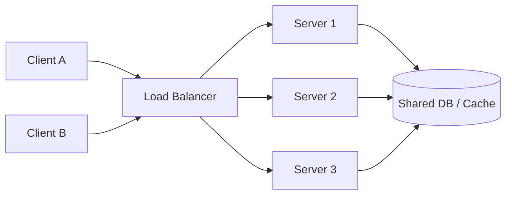
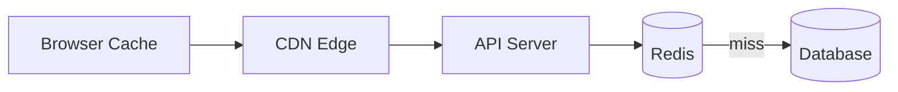
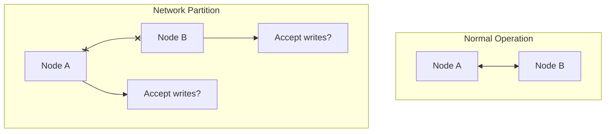
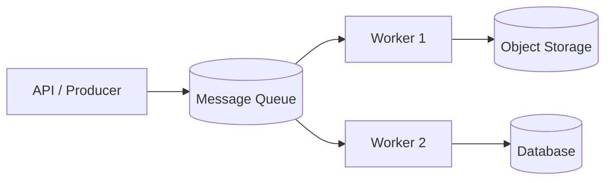
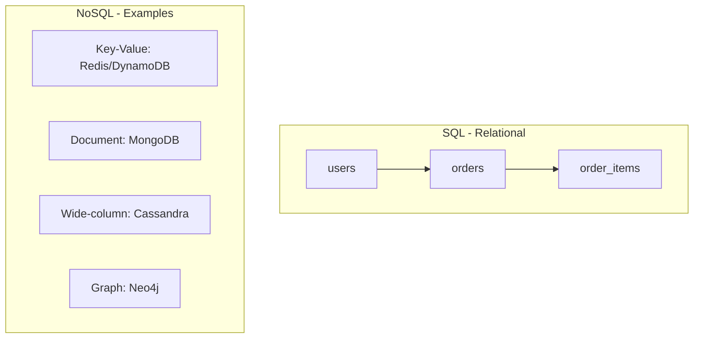
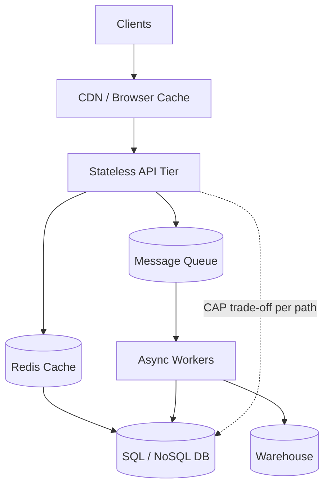

# Core System Design Foundations

> **One-line summary:** Scalable data systems stay stateless, cache aggressively, choose consistency trade-offs consciously, decouple with queues, pick the right database for the job, and expose clear APIs.

These six ideas show up in almost every system design interview and every production data platform. Master them first — everything else (Kafka pipelines, lakehouses, CDC) builds on top.

---

## Table of Contents

1. [Statelessness](#1-statelessness)
2. [Caching](#2-caching)
3. [CAP Theorem](#3-cap-theorem)
4. [Message Queues](#4-message-queues)
5. [Databases — SQL vs NoSQL](#5-databases--sql-vs-nosql)
6. [API Design](#6-api-design)

---

## 1. Statelessness

### Layer 1 — Explain Like I'm New

**Analogy:** A food truck with no memory.

Every customer orders from scratch. The truck doesn't remember what you ordered yesterday. If the truck breaks down, another identical truck can take its place — no special knowledge required.

**One sentence:** A stateless server treats every request as independent and stores no session data in memory between requests.

**Tiny example:** You hit `GET /users/42` twice. The server doesn't "remember" you from the first call. It looks up user 42 from a database (or cache) both times.



Any server can handle any request. That's the point.

---

### Layer 2 — How It Works

**Stateful vs stateless:**

| | Stateful | Stateless |
|---|----------|-----------|
| Session data | Stored in server RAM | Stored externally (DB, Redis, JWT) |
| Scaling | Sticky sessions or complex routing | Add servers freely behind a load balancer |
| Failure | Lose in-memory state on crash | Another server picks up immediately |
| Example | WebSocket chat room on one pod | REST API reading from Postgres |

**Where state actually lives in stateless systems:**

- **Database** — user profiles, orders, pipeline metadata
- **Cache (Redis)** — sessions, rate-limit counters, hot keys
- **Client** — JWT tokens, cookies with opaque session IDs
- **Object storage** — files, parquet datasets, model artifacts

**Why data engineering cares:** Spark executors, Flink task managers, and Airflow workers are designed to be replaceable. If a worker dies mid-job, the orchestrator reschedules the task. State lives in the metastore, checkpoint, or object storage — not in the worker's head.

---

### Layer 3 — Production Reality

**What breaks:**

- **Sticky sessions by accident** — load balancer pins user to one pod; that pod becomes a hotspot.
- **Local disk as "temporary" state** — pod restarts, data vanishes. Seen in poorly designed batch jobs writing to `/tmp`.
- **In-memory dedup** — works on one instance; duplicates appear when you scale to ten.

**How teams fix it:**

- Externalize all durable state (S3, HDFS, warehouse tables).
- Use **idempotency keys** on writes so retries are safe.
- Design pipelines so any worker can replay from a checkpoint.

**Observability:** Track per-instance memory growth. If one pod's RAM climbs while others stay flat, you probably leaked state into the process.

---

### Layer 4 — Interview Angle

**Common questions:**

- "Why should API servers be stateless?"
- "Where would you store user session data?"
- "How does statelessness help during deployments?"

**Strong answer structure:**

1. Stateless servers scale horizontally — add/remove instances without migration.
2. Rolling deploys and auto-healing work because any instance can serve any request.
3. State moves to shared stores with defined consistency and backup policies.

**Follow-up:** "Is Kafka stateless?" — Brokers are stateful (they hold partitions on disk), but consumers achieve resilience via consumer groups and offset commits stored in Kafka or an external store. Nuance matters.

**At 10x scale:** Shard state by tenant or key range. Stateless compute + partitioned state is the default pattern.

---

### Layer 5 — Hands-On

```python
# BAD: in-memory session store (does not scale)
sessions = {}

def get_cart(user_id):
    return sessions.get(user_id, [])

# GOOD: external store
def get_cart(user_id):
    return redis.get(f"cart:{user_id}") or []
```

---

## 2. Caching

### Layer 1 — Explain Like I'm New

**Analogy:** Keeping frequently used tools on your desk instead of walking to the warehouse every time.

The warehouse (database) has everything, but the trip is slow. Your desk (cache) holds what you need right now — but it might be slightly out of date.

**One sentence:** Caching stores copies of data closer to where it's needed so reads are faster, trading freshness for speed.

**Tiny example:** A dashboard shows "total users: 1,000,042." That number is cached for 60 seconds instead of running `SELECT COUNT(*)` on a billion-row table every page load.



---

### Layer 2 — How It Works

**Three common cache layers:**

| Layer | What it caches | Typical TTL | Example |
|-------|----------------|-------------|---------|
| **Browser cache** | Static assets, API responses (if allowed) | Minutes to days | `Cache-Control: max-age=3600` |
| **CDN** | Images, JS, CSS, API at edge | Seconds to hours | CloudFront, Fastly |
| **Application cache (Redis)** | Query results, sessions, rate limits | Seconds to hours | `GET user:42:profile` |

**Cache patterns:**

- **Cache-aside** — app checks cache; on miss, reads DB and populates cache.
- **Write-through** — write to cache and DB together.
- **Write-behind** — write to cache first, flush to DB asynchronously (fast, riskier).

**Cache key design (data engineering):**

```
daily_revenue:2024-06-22:region=EU   → aggregated metric
pipeline:run:job_8812:status         → orchestration state
feature:user_42:last_7d_clicks       → ML feature store
```

Keys must be deterministic and versioned when schema changes.

---

### Layer 3 — Production Reality

**What breaks:**

- **Cache stampede** — key expires; 10,000 requests hit DB at once.
- **Stale reads** — user updates profile; cache still shows old name for 5 minutes.
- **Hot keys** — one Redis key gets 100% of traffic; single shard melts.
- **Invalidation bugs** — hardest problem in computer science, per folklore.

**How teams fix it:**

- **TTL + jitter** — stagger expirations.
- **Probabilistic early refresh** — refresh before expiry under load.
- **Cache locking** — one request rebuilds; others wait or serve stale.
- **Explicit invalidation** — on write, delete `user:42:*` keys.
- **Local + distributed cache** — Caffeine in-process + Redis cluster.

**For data pipelines:** Cache intermediate aggregates in Redis or materialized views. Invalidate on partition arrival, not on wall-clock guesswork.

**Metrics to watch:** hit rate, miss latency, eviction rate, memory pressure, stale-serving count.

---

### Layer 4 — Interview Angle

**Common questions:**

- "Design a caching layer for a read-heavy API."
- "How do you keep cache and database consistent?"
- "When would you NOT cache?"

**When NOT to cache:**

- Financial balances requiring strong consistency.
- Rapidly changing data (live bidding, stock ticks).
- Low-traffic endpoints where cache overhead exceeds benefit.

**Follow-up:** "CDN vs Redis?" — CDN caches HTTP responses at the edge (geographic latency). Redis caches application objects (business logic, aggregations). They complement each other.

**At 100x scale:** Multi-tier caching, read replicas as "slow cache," precomputed rollups in the warehouse, and edge compute for personalization.

---

### Layer 5 — Hands-On

```python
import json
import redis

r = redis.Redis()

def get_daily_revenue(date: str) -> float:
    key = f"revenue:{date}"
    cached = r.get(key)
    if cached:
        return float(cached)  # cache hit

    # cache miss — expensive query
    revenue = db.query("SELECT SUM(amount) FROM orders WHERE date = %s", date)
    r.setex(key, 3600, str(revenue))  # TTL 1 hour
    return revenue
```

```http
# CDN / browser caching via HTTP headers
Cache-Control: public, max-age=300, stale-while-revalidate=60
ETag: "abc123"
```

---

## 3. CAP Theorem

### Layer 1 — Explain Like I'm New

**Analogy:** A group chat during a network outage.

- **Consistency** — everyone sees the same messages in the same order.
- **Availability** — everyone can always send and read messages.
- **Partition tolerance** — the system keeps working even when some people lose connection to each other.

When the network splits the group, you can't guarantee *both* perfect consistency and instant availability. You pick.

**One sentence:** In a distributed system, when nodes can't talk to each other (a partition), you must choose between strong consistency and availability.

**Tiny example:** Two data centers lose connectivity. Do you block writes until they reconnect (CP), or accept writes on both sides and reconcile later (AP)?



---

### Layer 2 — How It Works

**CAP in plain terms:**

| Property | Meaning |
|----------|---------|
| **C — Consistency** | Every read sees the latest write (or an error) |
| **A — Availability** | Every request gets a non-error response |
| **P — Partition tolerance** | System continues despite network failures between nodes |

**Important nuance:** CAP applies during a partition. When the network is healthy, you can have both C and A.

**Typical classifications (simplified):**

| System | Lean | Real-world behavior |
|--------|------|---------------------|
| PostgreSQL (single primary) | CP | Writes go to primary; replicas may lag (eventual consistency on reads) |
| Cassandra, DynamoDB | AP | Tunable consistency; available during partitions |
| ZooKeeper, etcd | CP | Consistent coordination; may refuse writes during partition |
| Redis Cluster | Mostly AP | Async replication; possible lost writes on failover |

**PACELC extension (worth knowing):** Even without a partition, you trade **Latency** vs **Consistency** — e.g., async replication for speed.

---

### Layer 3 — Production Reality

**What breaks:**

- **Assuming strong consistency everywhere** — cross-region Postgres reads from replica; user sees stale data.
- **Split-brain** — two primaries accept writes during partition; data diverges.
- **Ignoring quorum** — minority partition still serves traffic.

**How teams fix it:**

- Define **RPO/RTO** and consistency SLAs per use case.
- Use **leader election** (etcd, ZooKeeper) for single-writer paths.
- **Eventual consistency + idempotent consumers** for pipelines.
- **CRDTs or merge strategies** for AP systems.

**Data engineering angle:**

- Warehouse loads are often **eventually consistent** — data lands in S3, appears in table minutes later.
- **Exactly-once** is a consistency promise at the processing layer, not always at the storage layer.
- Stream processing uses **watermarks** and **late-arriving data** policies — explicit consistency trade-offs.

**Observability:** replication lag metrics, read-your-writes violations (tracked via synthetic probes), split-brain alerts.

---

### Layer 4 — Interview Angle

**Common questions:**

- "What is CAP? Is it still relevant?"
- "Is your system CP or AP?"
- "How do you handle consistency across regions?"

**Strong answer:** "We choose per feature. Payment ledger = strong consistency (CP behavior). Product catalog = available reads with seconds of lag (AP behavior). Pipelines use at-least-once delivery with idempotent sinks."

**Follow-ups:**

- "What's eventual consistency?" — Replicas converge over time; reads may be stale briefly.
- "What's linearizability?" — Strongest single-object consistency; reads appear instantaneous and global.

**At 10x scale:** Per-region active-active with conflict resolution, or active-passive with failover and defined data loss window.

---

### Layer 5 — Hands-On

```sql
-- PostgreSQL: read-your-writes via primary
SET SESSION CHARACTERISTICS AS TRANSACTION READ WRITE;
SELECT * FROM orders WHERE id = 8812;

-- Cassandra: tunable consistency per query
-- QUORUM = majority of replicas must agree
SELECT * FROM events WHERE user_id = 42;
-- consistency level set at driver: LOCAL_QUORUM
```

---

## 4. Message Queues

### Layer 1 — Explain Like I'm New

**Analogy:** A post office between you and a busy friend.

You drop a letter in the mailbox (producer). You don't wait for your friend to read it. The post office holds it until they're ready (consumer). If your friend is sick, letters pile up safely — they catch up later.

**One sentence:** Message queues let services communicate asynchronously by buffering messages between senders and receivers.

**Tiny example:** A user uploads a video. The API puts `{"video_id": 99}` on a queue and returns `202 Accepted`. A worker transcodes the video in the background.



---

### Layer 2 — How It Works

**Core concepts:**

| Term | Meaning |
|------|---------|
| **Producer** | Sends messages |
| **Consumer** | Reads and processes messages |
| **Topic / Queue** | Named channel for messages |
| **Partition** | Ordered sub-stream (Kafka) for parallelism |
| **Offset** | Bookmark of what's been consumed |
| **DLQ** | Dead-letter queue for poison messages |

**Kafka vs SQS (when teams pick what):**

| | **Apache Kafka** | **AWS SQS** |
|---|------------------|-------------|
| Model | Distributed commit log | Managed queue |
| Retention | Configurable (days/forever) | Deleted after ack (unless DLQ) |
| Replay | Yes — reset offset and re-read | No native replay |
| Ordering | Per partition | FIFO queues only (SQS FIFO) |
| Best for | Event streaming, CDC, analytics pipelines | Task queues, decoupling microservices |
| Ops burden | Higher (clusters, tuning) | Low (fully managed) |

**Delivery guarantees:**

- **At-most-once** — may lose messages; no duplicates.
- **At-least-once** — may duplicate; none lost (most common; pair with idempotency).
- **Exactly-once** — hardest; Kafka transactions + idempotent producers + dedup sinks.

**Async workflow pattern:**

```
Event → Queue → Worker → Downstream queue → Aggregator → Warehouse table
```

Each stage scales independently. Backpressure shows up as growing queue lag.

---

### Layer 3 — Production Reality

**What breaks:**

- **Poison messages** — bad payload crashes consumer in a loop.
- **Consumer lag** — processing slower than arrival rate; data gets stale.
- **Ordering assumptions** — scale to 10 partitions; global order is gone.
- **Duplicate processing** — consumer crashes after work but before ack.

**How teams fix it:**

- **DLQ** + alert on DLQ depth.
- **Idempotent consumers** — `INSERT ... ON CONFLICT`, dedup keys.
- **Backpressure** — pause polling, scale consumers, or shed load.
- **Schema registry** — enforce Avro/Protobuf contracts on Kafka topics.

**Data engineering patterns:**

- **CDC** — Debezium publishes row changes to Kafka; Flink/Spark consumes.
- **Medallion architecture** — bronze (raw events) → silver (cleaned) → gold (aggregates), each stage a topic or table.
- **Late data** — watermark policies in stream processors.

**Metrics:** consumer lag, publish rate, processing latency p99, DLQ rate, rebalance frequency.

---

### Layer 4 — Interview Angle

**Common questions:**

- "Kafka vs RabbitMQ vs SQS?"
- "How do you handle failed messages?"
- "Design an event-driven order pipeline."

**Design walkthrough (order placed):**

1. API writes order to DB, publishes `OrderPlaced` event.
2. Inventory service consumes, reserves stock.
3. Payment service consumes, charges card.
4. Fulfillment service consumes, creates shipment.
5. Each service owns its data; queue provides decoupling and burst absorption.

**Follow-ups:**

- "How do you guarantee order?" — single partition keyed by `order_id`.
- "How do you replay?" — Kafka: new consumer group from `earliest`. SQS: not built-in; re-publish from event store.

**At 100x scale:** Tiered storage in Kafka, compacted topics for changelog, separate clusters for operational vs analytics traffic.

---

### Layer 5 — Hands-On

```python
# Producer pseudocode (Kafka)
producer.send(
    topic="orders",
    key=order_id,          # same key → same partition → ordering
    value={"event": "OrderPlaced", "order_id": order_id},
    headers={"trace_id": trace_id},
)

# Consumer with idempotency
def handle(msg):
    if already_processed(msg.id):
        return
    process(msg)
    mark_processed(msg.id)
    commit_offset()
```

```json
// SQS message with visibility timeout
{
  "video_id": 99,
  "retry_count": 0,
  "enqueued_at": "2024-06-22T10:00:00Z"
}
```

---

## 5. Databases — SQL vs NoSQL

### Layer 1 — Explain Like I'm New

**Analogy:** Filing cabinet vs shoeboxes.

- **SQL (relational)** — strict folders, labels, and rules. Every invoice goes in the same format. Great when structure matters.
- **NoSQL** — flexible boxes. Throw in JSON documents, wide columns, or key-value pairs. Great when shape varies or speed at huge scale matters.

**One sentence:** SQL databases enforce structured tables and relationships; NoSQL databases optimize for flexible schemas, horizontal scale, or specialized access patterns.

**Tiny example:**

- SQL: `users` table joins `orders` table — "show me total spend per customer."
- NoSQL: `GET session:user_42` — one key, one blob, sub-millisecond read.



---

### Layer 2 — How It Works

**When to use SQL:**

- Complex joins and aggregations (reporting, finance, operational analytics).
- Strong schema contracts between teams.
- Transactions across multiple rows (`BEGIN … COMMIT`).
- ACID guarantees required.

**When to use NoSQL:**

- Massive write throughput with simple access patterns (time-series, IoT).
- Schema evolves fast (product catalog, user-generated content).
- Geographic distribution with tunable consistency (DynamoDB, Cassandra).
- Caching, sessions, feature flags (Redis).

**ACID explained:**

| Property | Meaning | Why it matters |
|----------|---------|----------------|
| **Atomicity** | All or nothing | Transfer $100: debit and credit both succeed or both roll back |
| **Consistency** | Rules always hold | Balance never negative if constraint enforced |
| **Isolation** | Concurrent txs don't step on each other | Two bookings don't grab the last seat |
| **Durability** | Committed data survives crashes | Power loss after `COMMIT` doesn't lose the order |

**NoSQL and ACID:** Many NoSQL stores offer tunable or partial ACID (e.g., DynamoDB transactions on up to 25 items; MongoDB multi-document transactions). Don't assume "NoSQL = no transactions."

**Data engineering default:** Warehouse and lakehouse layers are SQL-first (BigQuery, Snowflake, Spark SQL). Operational sources may be either; ingestion normalizes into tabular form.

---

### Layer 3 — Production Reality

**What breaks:**

- **ORM-driven join hell on NoSQL** — forcing relational patterns onto DynamoDB.
- **Missing migrations** — schema drifts; downstream pipelines break silently.
- **Long transactions on hot rows** — lock contention; p99 latency spikes.
- **Cross-shard joins** — expensive at scale; denormalize or pre-aggregate.

**How teams fix it:**

- **Polyglot persistence** — Postgres for orders, Redis for sessions, Elasticsearch for search, S3 for raw events.
- **CDC** — operational DB changes stream to warehouse without hammering OLTP.
- **Read replicas** — analytics off primary.
- **Partitioning / sharding** — by `tenant_id` or date.

**Schema drift in pipelines:** Contract tests on ingestion (Great Expectations, dbt tests, protobuf schemas). Alert when column types change.

**Observability:** slow query log, lock wait time, replication lag, connection pool exhaustion.

---

### Layer 4 — Interview Angle

**Common questions:**

- "SQL vs NoSQL for a social media feed?"
- "What are ACID properties?"
- "How would you design the database for an e-commerce site?"

**E-commerce split (strong answer):**

| Data | Store | Why |
|------|-------|-----|
| Orders, payments | PostgreSQL | ACID, joins, integrity |
| Sessions, cart | Redis | Fast, TTL |
| Product search | Elasticsearch | Full-text, facets |
| Clickstream | Kafka → warehouse | Append-only, analytics |
| Product images | S3 + CDN | Blob storage |

**Follow-up:** "Normalization vs denormalization?" — Normalize for write integrity in OLTP; denormalize for read performance in OLAP.

**At 10x scale:** Sharding strategy, connection pooling (PgBouncer), read paths to replicas, archival to cold storage.

---

### Layer 5 — Hands-On

```sql
-- ACID transaction: transfer between accounts
BEGIN;
  UPDATE accounts SET balance = balance - 100 WHERE id = 1 AND balance >= 100;
  UPDATE accounts SET balance = balance + 100 WHERE id = 2;
  INSERT INTO transfers (from_id, to_id, amount) VALUES (1, 2, 100);
COMMIT;
```

```javascript
// Document store (MongoDB) — flexible schema
db.events.insertOne({
  user_id: 42,
  event_type: "click",
  properties: { page: "/checkout", experiment: "B" },
  ts: ISODate("2024-06-22T10:00:00Z")
})
```

---

## 6. API Design

### Layer 1 — Explain Like I'm New

**Analogy:** A restaurant menu with clear names, prices, and rules.

You don't guess how to order. The menu (API contract) says what's available, what you need to provide, and what you get back. If the menu changes, regulars appreciate a note ("v2: spicy option renamed").

**One sentence:** APIs are formal contracts that let systems exchange data reliably — design, versioning, and consistency determine how safe changes are over time.

**Tiny example:**

```
GET /api/v1/users/42        → 200 { "id": 42, "name": "Ada" }
POST /api/v1/orders         → 201 { "order_id": 8812 }
```

---

### Layer 2 — How It Works

**REST vs GraphQL:**

| | **REST** | **GraphQL** |
|---|----------|-------------|
| Style | Resources + HTTP verbs | Single endpoint, client specifies shape |
| Over/under-fetching | Common (fixed payloads) | Client picks fields |
| Caching | HTTP caching works naturally | Harder at CDN layer |
| Versioning | URL/header versioning | Schema evolution |
| Best for | Public APIs, simple CRUD, CDN-friendly | Mobile apps, varied clients, nested graphs |

**Versioning strategies:**

| Strategy | Example | Pros | Cons |
|----------|---------|------|------|
| URL path | `/v1/orders` | Obvious, easy routing | URL proliferation |
| Header | `Accept: application/vnd.api+json;version=2` | Clean URLs | Hidden, easy to miss |
| Query param | `/orders?version=2` | Simple | Messy at scale |

**Contracts (why data teams care):**

- **OpenAPI / Swagger** — REST schema, generates docs and clients.
- **Protobuf / Avro** — binary schemas for gRPC and Kafka.
- **JSON Schema** — validate payloads at the edge.

Breaking change = removing a field, changing a type, or renaming without backward compatibility. Non-breaking = adding optional fields.

**HTTP semantics that matter:**

| Code | Meaning |
|------|---------|
| 200 | OK |
| 201 | Created |
| 202 | Accepted (async processing) |
| 400 | Bad request (client fault) |
| 404 | Not found |
| 409 | Conflict |
| 429 | Rate limited |
| 500 | Server error |

**Pagination:** cursor-based (`?after=xyz`) scales better than offset (`?page=9000`) on large tables.

---

### Layer 3 — Production Reality

**What breaks:**

- **Undocumented breaking changes** — mobile app crashes in production.
- **No rate limits** — one client takes down the API.
- **Chatty GraphQL** — N+1 queries without DataLoader.
- **Giant payloads** — returning 10 MB JSON when client needed one field.

**How teams fix it:**

- **API gateway** — auth, rate limiting, request validation.
- **Deprecation policy** — sunset headers, migration guides, minimum support window.
- **Contract testing** — Pact, schema diff in CI.
- **Idempotency-Key header** on POST for safe retries.

**Data engineering APIs:**

- Ingestion endpoints (`POST /events`) with batch support and backpressure (429 + `Retry-After`).
- Export endpoints with async jobs (`202` + polling or webhook).
- Query APIs over warehouse with cost guards (row limits, query timeouts).

**Observability:** request rate, error rate, latency histograms per route, payload size, schema validation failures.

---

### Layer 4 — Interview Angle

**Common questions:**

- "Design a REST API for a URL shortener."
- "REST vs GraphQL — when would you pick each?"
- "How do you version APIs without breaking clients?"

**URL shortener API sketch:**

```
POST   /v1/links          { "url": "...", "custom_slug": "optional" }
GET    /v1/links/{slug}   → redirect or metadata
GET    /v1/links/{id}/stats?from=&to=
DELETE /v1/links/{id}
```

Requirements → estimate QPS → stateless API + Redis cache hot slugs + Postgres durable store + async click aggregation via queue.

**Follow-ups:**

- "How handle auth?" — API keys for partners, OAuth for users, mTLS service-to-service.
- "How document?" — OpenAPI spec published; changelog per version.

**At 10x scale:** GraphQL federation or BFF per client, edge caching for GET, async exports for heavy queries.

---

### Layer 5 — Hands-On

```yaml
# OpenAPI snippet
paths:
  /v1/users/{id}:
    get:
      parameters:
        - name: id
          in: path
          required: true
          schema:
            type: integer
      responses:
        '200':
          description: User found
          content:
            application/json:
              schema:
                $ref: '#/components/schemas/User'
        '404':
          description: User not found
```

```graphql
# GraphQL — client specifies fields
query {
  user(id: 42) {
    name
    orders(last: 5) {
      id
      total
    }
  }
}
```

```http
POST /v1/payments HTTP/1.1
Idempotency-Key: 7f3e8a1b-2c4d-5e6f-9a0b-1c2d3e4f5a6b
Content-Type: application/json

{ "amount": 4999, "currency": "USD", "order_id": 8812 }
```

---

## How These Six Ideas Fit Together



A typical data platform:

1. **Stateless** API and workers scale on demand.
2. **Cache** protects OLTP and precomputes hot aggregates.
3. **CAP** choices differ per store (strong for payments, eventual for analytics).
4. **Queues** decouple ingestion from processing and absorb spikes.
5. **Databases** matched to access pattern — OLTP SQL, events on Kafka, analytics in SQL warehouse.
6. **APIs** expose contracts with versioning so producers and consumers evolve safely.

---

## Quick Interview Cheat Sheet

| Topic | Remember this |
|-------|---------------|
| Statelessness | State in DB/Redis/S3; any instance can serve any request |
| Caching | Cache-aside + TTL; watch stampede and invalidation |
| CAP | During partition: pick C or A; design per feature |
| Queues | Decouple, absorb bursts; at-least-once + idempotency |
| SQL vs NoSQL | SQL for joins/ACID; NoSQL for scale/flexible patterns |
| API Design | REST for resources; version explicitly; contract-first |

---

## Conclusion

You started this lesson with six ideas that sound simple on their own — don't store state in servers, cache hot data, pick consistency trade-offs, use queues to decouple, choose the right database, and design clear APIs. Together, they form the **foundation** of almost every system you will ever design or operate.

Think of it this way:

- **Statelessness** lets you scale and recover without heroics.
- **Caching** keeps users fast without melting your database.
- **CAP** reminds you that every distributed choice has a cost — design per feature, not per buzzword.
- **Message queues** turn fragile synchronous chains into resilient async workflows.
- **Databases** are tools, not religions — SQL for integrity and joins, NoSQL for scale and flexibility.
- **API design** is how teams agree on contracts so systems can evolve without breaking each other.

When you see a "complex" architecture — a lakehouse, a real-time CDC pipeline, a Kafka + Flink stack — it is almost always these six ideas stacked on top of each other. There is no shortcut past them. Teams that skip fundamentals end up with systems that look impressive in a diagram but fail in production: sticky sessions that won't scale, caches that serve stale financial data, queues without idempotency, and APIs that break mobile clients on every deploy.

**Learn the fundamentals first. Then go deep.**

You do not need to memorize every tool on day one. You need to understand *why* each pattern exists so that when someone says "we'll just add Kafka," you can ask the right questions: What consistency do we need? Where does state live? What happens when a consumer crashes mid-message? How do we version the contract?

That mindset — calm, curious, grounded in basics — is what separates engineers who pass interviews from engineers who ship reliable systems. Revisit these ideas often. They compound. Every advanced topic in this repository builds directly on what you covered here.

Keep learning. The complex stuff gets easier once the foundation is solid.

---

## Next Topics

Continue with [ROADMAP.md](../../ROADMAP.md):

- [Data modeling concepts](../data-engineering/data-modeling-concepts.md) — fact tables, dimensions, grain, SCDs, star vs snowflake
- Batch vs streaming — when to use each
- ETL / ELT pipelines — orchestration, idempotency, backfill
