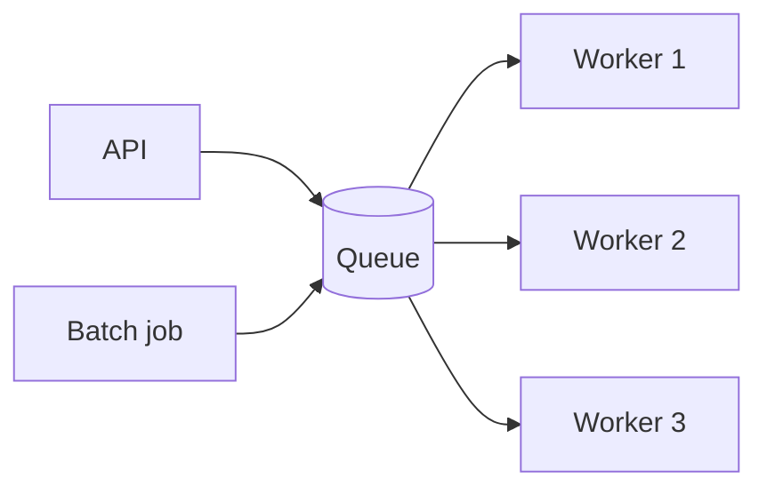
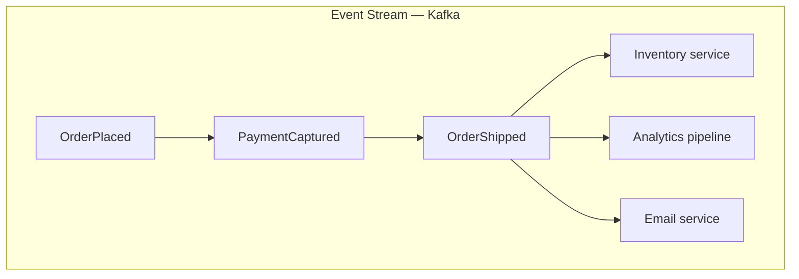
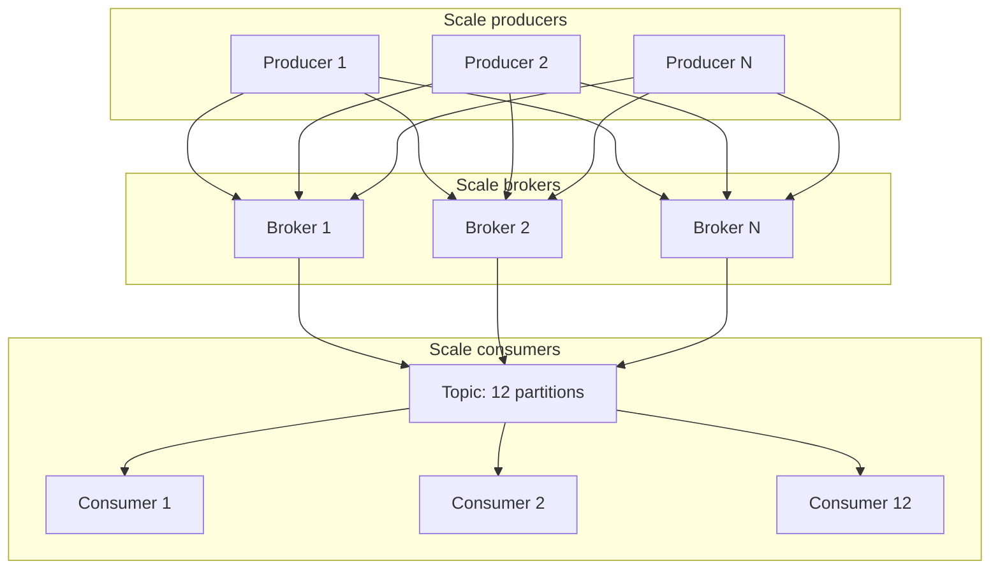
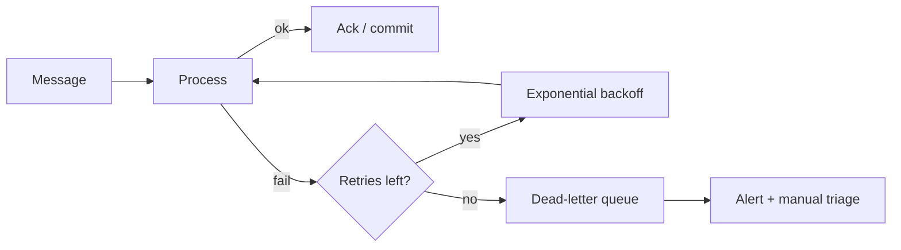
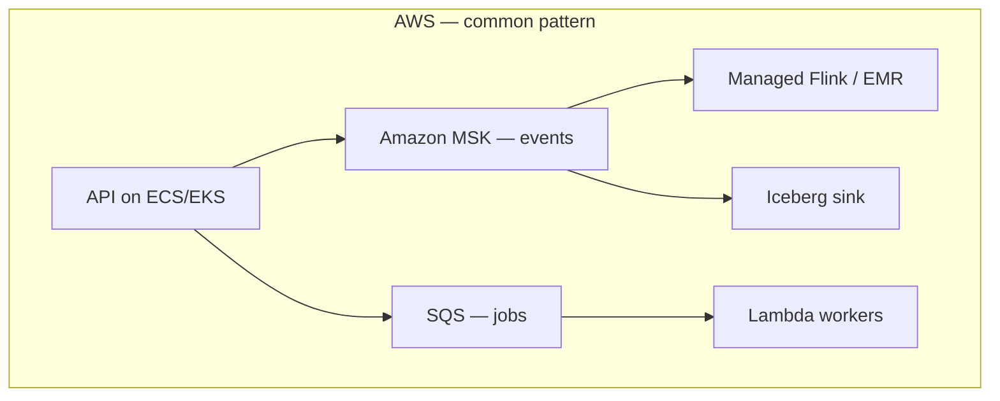
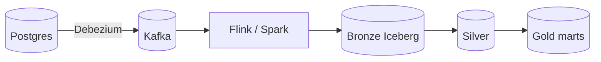

# Message Queues — Deep Dive

> **One-line summary:** Message queues **decouple producers from consumers**, absorb traffic spikes, and make distributed systems resilient — but at scale, your enemies become **consumer lag, hot partitions, and poison messages**, not "which broker to pick."

This lesson goes far beyond the overview in [Core Foundations](core-system-design-foundations.md). Read that first if message queues are new to you.

---

## Table of Contents

0. [Prerequisites](#0-prerequisites)
1. [What Is a Message Queue?](#1-what-is-a-message-queue)
2. [Core Concepts and Vocabulary](#2-core-concepts-and-vocabulary)
3. [Queue vs Stream — Two Mental Models](#3-queue-vs-stream--two-mental-models)
4. [Kafka vs RabbitMQ vs SQS vs Others](#4-kafka-vs-rabbitmq-vs-sqs-vs-others)
5. [Scalability — How Queues Scale](#5-scalability--how-queues-scale)
6. [Production Bottlenecks and Fixes](#6-production-bottlenecks-and-fixes)
7. [Infrastructure — What to Deploy Where](#7-infrastructure--what-to-deploy-where)
8. [Optimization Playbook](#8-optimization-playbook)
9. [Patterns for Data Engineering](#9-patterns-for-data-engineering)

---

## 0. Prerequisites

| You should understand | Why | Where |
|----------------------|-----|-------|
| Stateless services | Consumers scale horizontally | [Core Foundations — Statelessness](core-system-design-foundations.md#1-statelessness) |
| CAP theorem | Availability vs consistency during broker failures | [Core Foundations — CAP](core-system-design-foundations.md#3-cap-theorem) |
| Async / decoupling | Why not synchronous HTTP everywhere | [Production Skills — Async](../production/production-skills.md#2-async-programming--do-more-without-blocking) |
| Idempotency | At-least-once delivery creates duplicates | [Core Foundations — Message Queues](core-system-design-foundations.md#4-message-queues) |

---

## 1. What Is a Message Queue?

### Layer 1 — Explain Like I'm New

**Analogy:** A post office between a busy sender and a busy receiver.

You drop a letter and leave. The post office holds it safely. Your friend picks it up when ready. If your friend is sick for a week, letters pile up — but nothing is lost (within retention limits).

**One sentence:** A message queue is a **buffer** between services so producers and consumers don't have to be online at the same time or run at the same speed.

**Tiny example:**

```
API receives order  →  publishes {"order_id": 8812}  →  returns 202 Accepted
                              ↓
                        [Message Queue]
                              ↓
Payment worker (when ready) charges card, updates DB
```

Without a queue: API waits 8 seconds for payment provider → user sees spinner → timeout on spike.



---

### Layer 2 — How It Works

**Problems queues solve:**

| Problem | Without queue | With queue |
|---------|---------------|------------|
| Traffic spike | API overload, cascading failures | Queue absorbs burst; workers catch up |
| Slow downstream | User waits | Async processing |
| Service down | Request fails | Messages retained; retry when back |
| Tight coupling | Every service calls every service | Publish once; many consumers subscribe |

**When NOT to use a queue:**

- User needs synchronous answer in <200ms ("What's my balance right now?")
- Strong immediate consistency across services (use transaction or sync API)
- Tiny system where operational complexity exceeds benefit

---

## 2. Core Concepts and Vocabulary

Every technical term you need:

| Term | Plain English | Detail |
|------|---------------|--------|
| **Message** | One unit of data | JSON, Avro, Protobuf payload + headers |
| **Producer** | Sender | API, ETL job, CDC connector |
| **Consumer** | Receiver | Worker, stream processor, lambda |
| **Broker** | Queue server | Kafka broker, RabbitMQ node, SQS (managed) |
| **Topic** | Named channel (pub/sub) | `orders`, `clickstream`, `cdc.users` |
| **Queue** | Named channel (point-to-point) | One consumer group typically gets each message once |
| **Partition** | Ordered sub-stream | Kafka/Pulsar split topic for parallelism |
| **Offset** | Bookmark in a partition | Consumer's position — "I've read up to 482913" |
| **Consumer group** | Team of consumers sharing work | Each partition → one consumer in group at a time |
| **Retention** | How long messages are kept | Kafka: days/forever; SQS: until ack (max 14 days) |
| **Ack (acknowledge)** | "I'm done processing" | Message removed or offset committed |
| **DLQ** | Dead-letter queue | Parking lot for poison messages |
| **Visibility timeout** | SQS: hide message while processing | If not acked in time, message reappears |
| **Backpressure** | Slow down producers when consumers lag | Pause publish, shed load, scale consumers |
| **Consumer lag** | How far behind consumers are | `#1 metric to watch` |
| **Rebalance** | Redistribute partitions across consumers | Necessary but causes pauses if stormy |
| **Hot partition** | One partition gets disproportionate traffic | Bottleneck despite many consumers |
| **Poison message** | Message that always crashes consumer | Infinite retry loop without DLQ |

**Delivery guarantees:**

| Guarantee | Meaning | Trade-off |
|-----------|---------|-----------|
| **At-most-once** | May lose messages | Fast; rare for critical data |
| **At-least-once** | May duplicate; none lost | **Most common** — requires idempotent consumers |
| **Exactly-once** | Neither lose nor duplicate | Hard; Kafka transactions + idempotent producers + careful sinks |

**Production default:** at-least-once + idempotent consumers. Don't chase exactly-once until you have a proven need and budget for complexity.

---

## 3. Queue vs Stream — Two Mental Models

### Layer 1 — Explain Like I'm New

**Queue (task mailbox):** Each letter is taken by one person. Once taken, it's gone (for that team).

**Stream (newspaper archive):** Every subscriber can read the same editions. Old editions stay on the shelf for a while — new readers can start from issue #1 or today's issue.

---

### Layer 2 — How It Works

| | **Queue (task)** | **Stream (log)** |
|---|------------------|------------------|
| Mental model | "Do this job" | "This happened" |
| Consumption | Usually one consumer group processes each message | Multiple independent consumer groups |
| Replay | Hard (SQS) or limited | Native (Kafka reset offset) |
| Ordering | FIFO queues or single partition | Per-partition ordering |
| Examples | SQS, RabbitMQ (classic) | Kafka, Kinesis, Pulsar, Redpanda |
| Best for | Job processing, commands | Event sourcing, CDC, analytics |



**Data engineering bias:** Analytics and CDC want **streams** (replay, multiple readers). Task triggers often want **queues** (simple, managed).

---

## 4. Kafka vs RabbitMQ vs SQS vs Others

### Layer 1 — Explain Like I'm New

Different post office designs for different cities. Some optimize for cheap simple mailboxes. Some optimize for newspaper archives the whole town reads.

---

### Layer 2 — How It Works

| System | Type | Ops burden | Throughput | Replay | Best for |
|--------|------|------------|------------|--------|----------|
| **Apache Kafka** | Stream | High (or Confluent Cloud $) | Very high | Yes | CDC, event backbone, stream processing |
| **AWS SQS** | Queue | None (managed) | High | No | Decoupling microservices, job queues |
| **AWS SNS** | Pub/sub fan-out | None | High | No | Notify many subscribers (often → SQS) |
| **RabbitMQ** | Queue/broker | Medium | Medium | Limited | Routing, classic AMQP, moderate scale |
| **Redis Streams** | Stream-lite | Low–medium | Medium | Yes (bounded) | Simple streaming, already have Redis |
| **Apache Pulsar** | Stream | High | Very high | Yes | Multi-tenancy, geo-replication |
| **Redpanda** | Stream (Kafka API) | Medium | Very high | Yes | Kafka-compatible, fewer JVM ops |
| **Google Pub/Sub** | Stream/queue hybrid | None | Very high | Replay (subscription) | GCP-native systems |
| **Azure Event Hubs** | Stream | None | High | Yes | Azure-native Kafka-like |

**Decision matrix:**

| Your situation | Pick |
|----------------|------|
| AWS microservices, simple async jobs | **SQS** (+ SNS for fan-out) |
| CDC + data lake + multiple stream consumers | **Kafka** (MSK or Confluent) |
| Already on GCP | **Pub/Sub** |
| Complex routing (topic exchanges, priorities) | **RabbitMQ** |
| Kafka API, want simpler ops | **Redpanda** or **WarpStream** |
| Low volume, already have Redis | **Redis Streams** (know limits) |

---

## 5. Scalability — How Queues Scale

### Layer 1 — Explain Like I'm New

**Analogy:** Supermarket checkout.

One lane = one partition. More lanes = more partitions. More cashiers = more consumers. But if everyone queues behind lane 3 because all frozen food is there, extra lanes don't help.

---

### Layer 2 — How It Works

**Horizontal scaling dimensions:**



| Scale what | How | Limit |
|------------|-----|-------|
| **Producers** | Add API instances | Broker ingress bandwidth |
| **Brokers** | Add Kafka brokers, rebalance partitions | Cluster coordination overhead |
| **Partitions** | More partitions per topic | **Max useful consumers ≈ partition count** |
| **Consumers** | More instances in consumer group | One consumer per partition max (per group) |

**The partition rule (Kafka):**

```
Max parallel consumers in one group ≤ number of partitions
```

12 partitions → at most 12 consumers doing work simultaneously. Adding a 13th consumer → sits idle.

**Partition key drives fairness:**

```python
# GOOD — spread by high-cardinality key
producer.send("orders", key=order_id, value=payload)

# BAD — all messages to one partition
producer.send("orders", key="US", value=payload)  # hot partition
```

**Ordering trade-off:**

- Need global order → 1 partition → **no horizontal scale** for that topic.
- Need order per user/order → partition by `user_id` or `order_id` → scale across users.

**SQS scaling:**

- Standard queues: nearly unlimited throughput; **no ordering** (mostly).
- FIFO queues: 300 msg/sec per queue (3000 with batching); ordering within message group.

---

### Layer 3 — Production Reality

**Scalability mistakes:**

| Mistake | Result |
|---------|--------|
| 3 partitions, 50 consumers | 47 idle consumers; wasted money |
| Partition by country on global app | US partition melts |
| Single partition for "we need order" | 1 consumer does all work |
| Giant messages (10 MB JSON) | Broker disk and network choke |

**Capacity planning sketch:**

```
Peak publish rate:     50,000 msg/sec
Peak consumer process:   200 msg/sec per worker
Workers needed:          50,000 / 200 = 250 → need ≥250 partitions for full parallelism
Retention 7 days:        50k * 86400 * 7 * avg_msg_size → disk math
```

Always model **disk, network, and consumer throughput** — not just "Kafka is scalable."

---

### Layer 4 — Interview Angle

**Common questions:**

- "How do you scale Kafka consumers?"
- "How do you preserve ordering?"
- "What limits Kafka throughput?"

**Strong answer:** "Increase partitions for parallelism; partition by a high-cardinality key for per-entity ordering. Scale consumers up to partition count. Monitor lag, disk, and rebalance frequency. Hot partitions are the real limit, not broker count."

---

## 6. Production Bottlenecks and Fixes

### Layer 1 — Explain Like I'm New

Queues fix overload — until the queue itself becomes the traffic jam. These are the jams you'll see at 2 a.m.

---

### Bottleneck 1: Consumer lag

**Symptom:** `consumer_lag` grows; data is hours stale; SLOs break.

**Causes:** Too few consumers, slow processing, downstream DB/API bottleneck, poison message retries.

**Fixes:**

| Fix | When |
|-----|------|
| Scale consumers (up to partition count) | CPU-bound processing |
| Add partitions (plan carefully — key strategy) | Sustained publish > consume |
| Optimize consumer code / SQL | Slow handlers |
| Batch DB writes | Per-message round trips |
| Increase parallelism across **multiple** consumer groups | Different workloads |
| Shed load / rate-limit producers | Emergency — protect system |

```python
# BAD — one DB insert per message
for msg in consumer:
    db.insert(msg)

# GOOD — micro-batch
batch = []
for msg in consumer:
    batch.append(msg)
    if len(batch) >= 500:
        db.insert_many(batch)
        commit_offset()
        batch.clear()
```

---

### Bottleneck 2: Hot partition

**Symptom:** One broker CPU/disk spikes; most consumers idle; lag on one partition only.

**Causes:** Bad partition key (status flag, country code), celebrity user, default key = null → same partition.

**Fixes:**

- Use high-cardinality keys: `user_id`, `order_id`, `uuid`.
- **Salt** hot keys: `hash(user_id + salt)` split one logical key across partitions (loses strict order for that key — document trade-off).
- Split topic: `orders_vip` vs `orders_standard`.
- Custom partitioner for known hot entities.

---

### Bottleneck 3: Poison messages

**Symptom:** Consumer crashes on same message forever; lag infinite; DLQ fills slowly.

**Causes:** Malformed payload, schema drift, bug in handler, toxic content.

**Fixes:**



| Practice | Detail |
|----------|--------|
| Max retries | 3–5 with exponential backoff |
| DLQ | Separate topic/queue; alert on depth |
| Schema validation | Reject at ingest — Avro/Protobuf + registry |
| Idempotent handler | Safe to retry without double effect |
| **Don't** infinite retry | Blocks partition progress |

---

### Bottleneck 4: Rebalance storm

**Symptom:** Consumers pause every few minutes; lag spikes; "Revoking partitions" in logs.

**Causes:** Frequent deploys, k8s pod churn, `session.timeout.ms` too low, processing exceeds `max.poll.interval.ms`.

**Fixes:**

| Fix | Kafka setting / practice |
|-----|--------------------------|
| Static membership | `group.instance.id` — reduce rebalance on restart |
| Increase timeouts | `max.poll.interval.ms`, `session.timeout.ms` |
| Cooperative rebalance | `CooperativeStickyAssignor` |
| Fewer deploys during peak | Rolling update strategy |
| Separate consumer groups | Don't mix fast and slow consumers |

---

### Bottleneck 5: Broker disk / I/O

**Symptom:** Disk 95%; produce latency spikes; under-replicated partitions.

**Causes:** Retention too long, no compaction, replication factor 3 × huge volume, small messages (overhead).

**Fixes:**

- Tiered storage (Kafka) — hot SSD, cold S3.
- Reduce retention for high-volume topics.
- Compression: `lz4` or `zstd` on producers.
- Increase disk; monitor per-broker balance.
- `cleanup.policy=compact` for changelog topics (not event streams).

---

### Bottleneck 6: Network and cross-AZ cost

**Symptom:** High AWS bill; produce/consume latency between AZs.

**Fixes:**

- Producers and consumers in **same AZ** as broker leader when possible.
- `acks=1` vs `acks=all` trade-off (see optimization).
- MirrorMaker / cluster linking only when needed for DR.

---

### Bottleneck 7: Duplicate processing

**Symptom:** Double charges, duplicate rows, duplicate emails.

**Cause:** At-least-once delivery + consumer crash after work but before ack.

**Fixes:**

- **Idempotency key** in DB: `INSERT ... ON CONFLICT DO NOTHING`.
- Store processed message IDs in Redis/DB with TTL.
- Kafka transactional consume-process-produce (heavy).
- Design for **effectively-once** at business layer.

---

### Bottleneck 8: Out-of-order processing

**Symptom:** Payment before order created; wrong state machine transitions.

**Fixes:**

- Partition by entity ID (all events for `order_8812` → same partition).
- Version field in message; ignore stale versions.
- Sequence numbers per entity in consumer.

---

### Observability — what to alert on

| Metric | Warning sign |
|--------|----------------|
| Consumer lag | Sustained growth |
| DLQ depth | > 0 and climbing |
| Produce p99 latency | Broker stress |
| Under-replicated partitions | Broker failure |
| Rebalance rate | Config or deploy issue |
| Message age (SQS) | Approaching retention |

---

## 7. Infrastructure — What to Deploy Where

### Layer 1 — Explain Like I'm New

**Analogy:** Own your delivery fleet vs hire UPS.

Self-hosted Kafka = own fleet (control, ops pain). SQS = UPS (simple, less flexible).

---

### Layer 2 — How It Works

**Deployment options:**

| Option | What you get | Best for |
|--------|--------------|----------|
| **Fully managed** | AWS MSK, Confluent Cloud, Pub/Sub, Event Hubs | Teams without Kafka ops expertise |
| **Self-hosted on K8s** | Strimzi, Kafka Helm | Control, cost at scale, strong platform team |
| **Self-hosted on VMs** | Bare Kafka cluster | Legacy, very large fixed workloads |
| **Serverless queue** | SQS, Lambda triggers | Simple job processing, low ops |
| **Hybrid** | MSK + SQS (events in, tasks out) | Common real-world pattern |



**AWS reference architecture:**

| Component | Service | Role |
|-----------|---------|------|
| Event backbone | **MSK** (Kafka) | CDC, clickstream, analytics |
| Task queue | **SQS** | Async jobs, retries, DLQ |
| Fan-out | **SNS → SQS** | One event, many workers |
| Stream processing | **Flink on Managed Service**, **Lambda** | Transform, enrich |
| Observability | **CloudWatch**, **Datadog**, **Prometheus** | Lag, broker metrics |

**GCP reference:**

| Component | Service |
|-----------|---------|
| Messaging | **Pub/Sub** |
| Processing | **Dataflow** (Beam) |
| Sink | **BigQuery**, **GCS** |

**Kubernetes (cloud-agnostic):**

| Tool | Role |
|------|------|
| **Strimzi** | Kafka operator on K8s |
| **Helm charts** | Kafka, RabbitMQ |
| **External Secrets** | Credentials for clients |

**High availability checklist:**

- [ ] Replication factor ≥ 3 (Kafka)
- [ ] `min.insync.replicas=2`, `acks=all` for critical data
- [ ] Multi-AZ brokers
- [ ] Cross-region DR only if RTO/RPO requires (expensive)
- [ ] IaC (Terraform) for topics, ACLs, retention
- [ ] Separate clusters for **operational** vs **analytics** traffic

**When to self-host Kafka:**

- Platform team with Kafka expertise
- Very high volume where managed cost exceeds ops cost
- Strict data residency / on-prem requirement

**When to use managed:**

- Default for most teams
- Faster time to production
- Built-in patching, monitoring hooks

---

## 8. Optimization Playbook

### Producer optimizations

| Knob | Recommendation | Trade-off |
|------|----------------|-----------|
| **Batching** | `linger.ms=5–20`, `batch.size` tuned | Latency ↑ slightly, throughput ↑↑ |
| **Compression** | `lz4` (fast) or `zstd` (better ratio) | CPU ↔ network/disk |
| **acks** | `all` for critical; `1` for telemetry | Durability ↔ latency |
| **Idempotent producer** | Enable for exactly-once-ish produce | Slight overhead |
| **Partition key** | High cardinality | Even load |
| **Message size** | Keep < 1 MB; use S3 reference for blobs | Broker limits |

```python
producer = KafkaProducer(
    bootstrap_servers=["..."],
    compression_type="lz4",
    linger_ms=10,
    batch_size=65536,
    acks="all",
    enable_idempotence=True,
)
```

### Consumer optimizations

| Knob | Recommendation |
|------|----------------|
| **Fetch size** | Increase `max.partition.fetch.bytes` for large messages |
| **Parallelism** | Consumers = partitions (not more) |
| **Commit strategy** | Commit **after** successful processing |
| **Poll loop** | Process in batches; don't block poll > `max.poll.interval.ms` |
| **Deserialize once** | Avro/Protobuf vs JSON — CPU matters at 50k msg/sec |

### Topic design

| Practice | Why |
|----------|-----|
| Right-size partitions | Start 12–24; scale with measured lag |
| Separate topics by SLA | `payments` vs `analytics_clicks` |
| Retention per topic | 7d clicks, 30d orders, forever CDC compacted |
| Schema registry | Evolve schemas without breaking consumers |

### Cost optimization

| Lever | Saving |
|-------|--------|
| Shorter retention on firehose topics | Disk |
| Compression | Disk + network |
| Tiered storage to S3 | SSD cost |
| Right-size MSK brokers | $$$ |
| SQS for low-volume tasks | Cheaper than Kafka partition |
| Batch consumers | Fewer DB round trips |

---

### Layer 5 — Hands-On

```python
# Idempotent consumer pattern
def process_message(msg):
    if store.exists(msg.key):
        return  # already processed
    do_work(msg)
    store.save(msg.key, ttl=7_days)
    consumer.commit()


# Kafka consumer with manual commit (pseudo)
for batch in consumer.poll_batch(max_records=500):
    try:
        handle_batch(batch)
        consumer.commit()
    except TransientError:
        pass  # retry same batch
    except PoisonMessage as e:
        dlq.send(e.msg)
        consumer.commit()  # skip poison after DLQ
```

```hcl
# Terraform sketch — MSK topic
resource "aws_msk_topic" "orders" {
  name               = "orders"
  partitions         = 24
  replication_factor = 3
  config = {
    "retention.ms"      = "604800000"  # 7 days
    "compression.type"  = "lz4"
    "min.insync.replicas" = "2"
  }
}
```

---

## 9. Patterns for Data Engineering

| Pattern | Queue role |
|---------|------------|
| **CDC → lakehouse** | Debezium → Kafka → Flink/Spark → Iceberg |
| **Medallion architecture** | Bronze/Silver/Gold as separate topics or consumer groups |
| **Backfill** | Reset consumer offset to `earliest`; reprocess with idempotent sink |
| **Late data** | Watermarks in stream processor; queue doesn't solve logic — processing does |
| **Quality gates** | Invalid messages → DLQ; metrics on reject rate |



---

## Quick Interview Cheat Sheet

| Topic | Remember this |
|-------|---------------|
| Why queues | Decouple, absorb bursts, async resilience |
| Stream vs queue | Replay + multiple readers → stream; simple jobs → queue |
| Scale consumers | Max parallelism = partition count (Kafka) |
| #1 prod metric | Consumer lag |
| Hot partition | Bad partition key — use high cardinality |
| Poison message | DLQ + max retries + alert |
| Delivery | At-least-once + idempotent consumers (default) |
| Critical produce | `acks=all`, RF=3, `min.insync.replicas=2` |
| Optimize | Batch, compress, right-size partitions, tiered storage |

---

## Conclusion

Message queues are not a magic scalability button — they are a **contract** between services: "I will accept work now and process it reliably later." That contract only holds if you design partitions, consumers, retention, and failure handling with the same care you give your database schema.

You covered the full arc:

- **Concepts** — producers, consumers, partitions, offsets, delivery guarantees.
- **Systems** — Kafka for streams, SQS for jobs, others when context demands.
- **Scalability** — partitions enable parallelism; hot keys destroy it.
- **Bottlenecks** — lag, poison messages, rebalances, disk, duplicates — each with concrete fixes.
- **Infrastructure** — managed MSK/Pub/Sub for most teams; self-host when ops maturity justifies it.
- **Optimization** — batching, compression, acks, idempotency, and right-sized topics.

Queues sit on fundamentals from [Core Foundations](core-system-design-foundations.md): stateless consumers, CAP trade-offs, and API design for async `202 Accepted` flows. If you skip idempotency and jump straight to Kafka, you will ship a pipeline that duplicates orders at scale and wonder why "Kafka is unreliable." Kafka is reliable. The harness around it wasn't.

**Learn idempotency before Kafka tuning. Learn partition keys before adding brokers. Learn consumer lag before buying a bigger cluster.**

The broker is the easy part. Partition strategy, consumer design, DLQ policy, and observability are what separate teams that ship from teams that fight incidents forever.

Keep learning. Model your next system on paper — publish rate, consumer throughput, partition count, retention disk math — before you provision infrastructure. The queue will tell you the truth about your architecture whether you're ready or not.

---

## Next Topics

Continue with [ROADMAP.md](../../ROADMAP.md):

- [Core foundations](core-system-design-foundations.md) — CAP, statelessness, API async patterns
- Batch vs streaming — when Kafka + Flink beats batch
- [Apache Iceberg](../data-engineering/apache-iceberg.md) — sink for stream consumers
- Design a CDC system — end-to-end exercise
