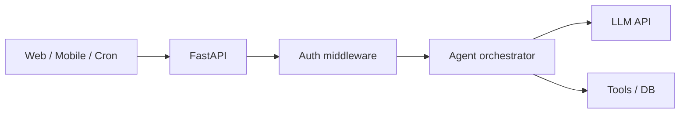
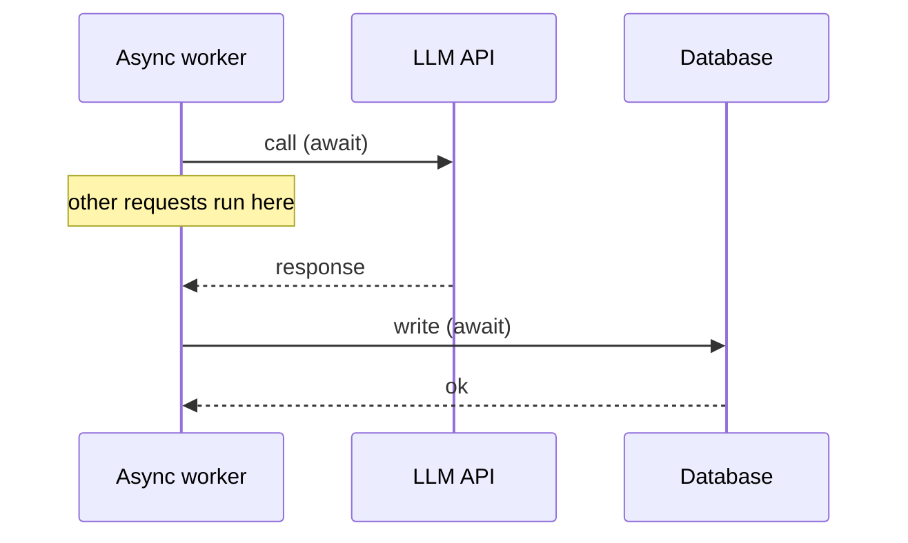
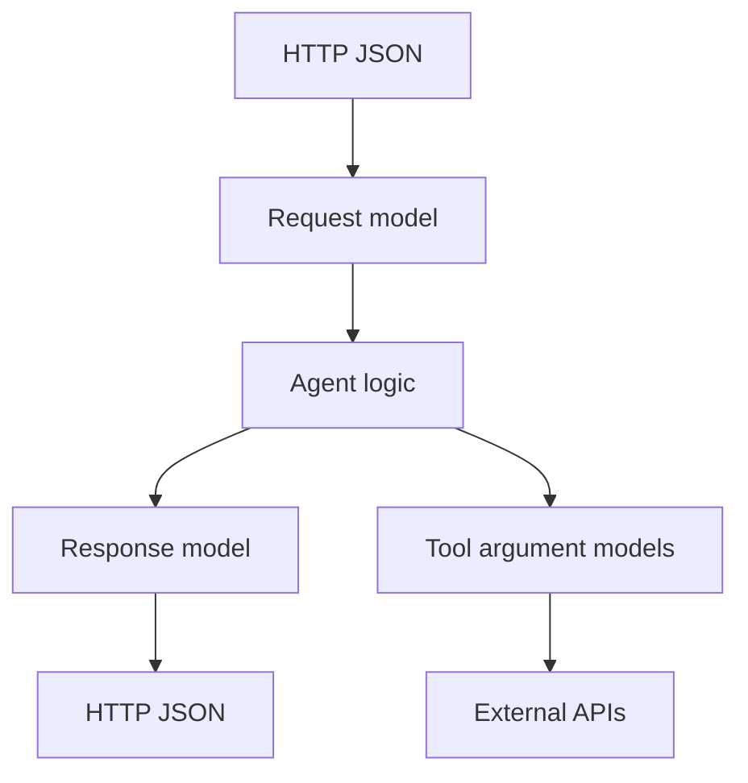
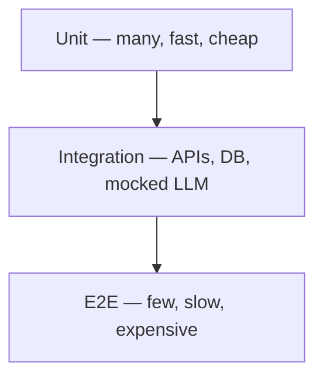
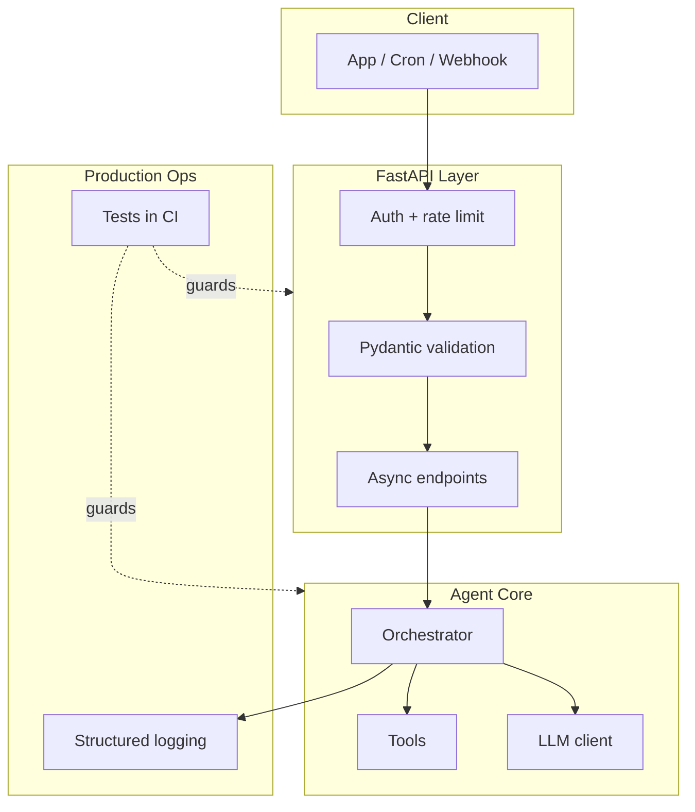

# Production Skills for Agent Builders

> **One-line summary:** Shipping an agent means exposing it through a **FastAPI** surface, handling I/O with **async**, validating every boundary with **Pydantic**, seeing failures through **logging**, and proving it works with **tests** — before users find the bugs.

A demo that calls OpenAI in a Jupyter notebook is not a product. Production skills are what turn "it worked once" into "it works at 2 a.m. when I'm asleep."

---

## Table of Contents

1. [FastAPI — How Your Agent Talks to the World](#1-fastapi--how-your-agent-talks-to-the-world)
2. [Async Programming — Do More Without Blocking](#2-async-programming--do-more-without-blocking)
3. [Pydantic — Predictable Data In and Out](#3-pydantic--predictable-data-in-and-out)
4. [Logging — Your X-Ray Vision](#4-logging--your-x-ray-vision)
5. [Testing — Ship Without Fear](#5-testing--ship-without-fear)
6. [How It All Fits Together](#6-how-it-all-fits-together)

---

## 1. FastAPI — How Your Agent Talks to the World

### Layer 1 — Explain Like I'm New

**Analogy:** A reception desk at a clinic.

Patients (clients) don't walk into the surgery room. They check in at the desk, show ID, fill a form, and get routed to the right room. The desk has rules: hours, capacity, who is allowed in.

**One sentence:** FastAPI is a Python framework for building **HTTP APIs** — the reception layer between your agent and the outside world.

**Tiny example:**

```
POST /v1/agent/run
{ "task": "Summarize this PDF", "document_id": "abc123" }
→ 202 { "run_id": "run_8812", "status": "queued" }
```

Your agent logic lives behind that endpoint. Clients never touch your prompts, API keys, or internal tools directly.



---

### Layer 2 — How It Works

**Why FastAPI for agents:**

| Benefit | What it means |
|---------|---------------|
| **Fast** | Built on Starlette + async; high throughput for I/O-bound agent workloads |
| **Typed** | Native Pydantic integration — request/response schemas for free |
| **Auto docs** | OpenAPI at `/docs` — clients and frontend teams self-serve |
| **Dependency injection** | Clean wiring for DB pools, auth, config |
| **Lightweight** | One process, easy Docker deploy — no heavy framework ceremony |

**Minimal agent endpoint:**

```python
from fastapi import FastAPI, Depends, HTTPException, status
from pydantic import BaseModel

app = FastAPI(title="Agent API", version="1.0.0")


class RunRequest(BaseModel):
    task: str
    document_id: str


class RunResponse(BaseModel):
    run_id: str
    status: str


@app.post("/v1/agent/run", response_model=RunResponse, status_code=status.HTTP_202_ACCEPTED)
async def run_agent(req: RunRequest) -> RunResponse:
  run_id = await enqueue_agent_run(req.task, req.document_id)
  return RunResponse(run_id=run_id, status="queued")
```

**Production endpoint checklist:**

| Concern | Pattern |
|---------|---------|
| Versioning | `/v1/...` in URL or `Accept` header |
| Auth | API keys, OAuth2, JWT via `Depends()` |
| Rate limiting | Middleware or API gateway |
| Timeouts | Return `202 Accepted` for long agent runs; poll or webhook for result |
| Health | `GET /health` and `GET /ready` (DB reachable?) |
| CORS | Explicit origins — never `*` in prod with credentials |

---

### Layer 3 — Production Reality

**What breaks:**

- **Synchronous LLM calls in sync endpoints** — one slow request blocks a worker thread; throughput collapses.
- **No request size limits** — client uploads 200 MB PDF; server OOMs.
- **Secrets in code** — API keys committed to git.
- **Giant responses** — returning full agent trace to client; payload bloat and data leaks.
- **No idempotency** — client retries POST → agent runs twice, double charges.

**How teams fix it:**

- Async endpoints + background tasks or job queue for long runs.
- `Content-Length` limits, file size caps, streaming for large outputs.
- Secrets from env / vault (`pydantic-settings`).
- Return `run_id` + poll `GET /v1/runs/{id}` instead of blocking 60s.
- `Idempotency-Key` header on POST; dedupe in Redis.

**Deploy pattern:**

```
Docker → ECS / Cloud Run / Kubernetes
       → uvicorn with multiple workers (CPU-bound) OR
       → single worker + async (I/O-bound agents — usually this)
       → reverse proxy (nginx) for TLS and rate limits
```

**Observability:** request rate, p95 latency, 4xx/5xx ratio, active runs, queue depth.

---

### Layer 4 — Interview Angle

**Common questions:**

- "How would you expose an LLM agent as a service?"
- "Sync vs async API for a 30-second agent run?"
- "How do you secure an agent API?"

**Strong answer:** "FastAPI with versioned endpoints, JWT auth, Pydantic validation. Long runs return 202 with a run ID; client polls or gets a webhook. Secrets in env, never in code. Rate limit per API key."

**Follow-up:** "Why FastAPI over Flask?" — Native async, automatic OpenAPI, Pydantic-first; better fit for I/O-heavy agent workloads.

---

### Layer 5 — Hands-On

```python
# dependencies.py
from fastapi import Header, HTTPException, status

async def verify_api_key(x_api_key: str = Header(...)) -> str:
    if x_api_key not in valid_keys():
        raise HTTPException(status_code=status.HTTP_401_UNAUTHORIZED, detail="Invalid API key")
    return x_api_key


# main.py
@app.post("/v1/agent/run")
async def run_agent(
    req: RunRequest,
    api_key: str = Depends(verify_api_key),
    idempotency_key: str | None = Header(default=None, alias="Idempotency-Key"),
):
    if idempotency_key and await is_duplicate(idempotency_key):
        return await get_existing_run(idempotency_key)
    return await start_run(req, idempotency_key)
```

```dockerfile
FROM python:3.12-slim
WORKDIR /app
COPY requirements.txt .
RUN pip install --no-cache-dir -r requirements.txt
COPY . .
CMD ["uvicorn", "main:app", "--host", "0.0.0.0", "--port", "8000"]
```

---

## 2. Async Programming — Do More Without Blocking

### Layer 1 — Explain Like I'm New

**Analogy:** A chef with one stove vs a chef who uses wait time wisely.

A **blocking** chef stands at the oven watching bread bake — doing nothing else. An **async** chef puts bread in, starts chopping vegetables while waiting, checks the oven when the timer rings. One chef, more done per hour.

**One sentence:** Async lets your program **start other work while waiting** on slow I/O (API calls, databases, file reads) instead of sitting idle.

**Tiny example:**

An agent that calls an LLM (2s), then a search API (1s), then writes to DB (0.5s).

- **Sync sequential:** ~3.5s per request, one thing at a time per thread.
- **Async sequential:** still ~3.5s for one request — but one thread can juggle **hundreds** of in-flight requests.



---

### Layer 2 — How It Works

**Sync vs async:**

| | Sync | Async |
|---|------|-------|
| While waiting on I/O | Thread blocked | Event loop runs other tasks |
| Best for | CPU-heavy work | I/O-heavy work (agents!) |
| Python syntax | `def` + normal calls | `async def` + `await` |
| Concurrency model | Threads/processes | Single-thread event loop (+ optional thread pool) |

**Agent workloads are I/O-bound:** waiting on OpenAI, Anthropic, vector DB, Postgres, HTTP tools. Async fits naturally.

```python
import asyncio
import httpx


async def call_llm(prompt: str) -> str:
    async with httpx.AsyncClient(timeout=30.0) as client:
        resp = await client.post("https://api.openai.com/v1/chat/completions", json={...})
        resp.raise_for_status()
        return resp.json()["choices"][0]["message"]["content"]


async def run_agent(task: str) -> str:
    context = await fetch_context(task)      # DB — await
    draft = await call_llm(task + context)   # LLM — await
    await save_result(task, draft)           # DB — await
    return draft
```

**Parallelism when tasks are independent:**

```python
# Sequential async: A then B
a = await fetch_a()
b = await fetch_b()

# Parallel async: A and B at the same time
a, b = await asyncio.gather(fetch_a(), fetch_b())
```

**When NOT to use async:**

- Heavy CPU (embedding millions of vectors) — use a worker process or `run_in_executor`.
- Libraries with no async support — don't fake it; use sync in a thread pool or pick an async client (`httpx`, `asyncpg`, `motor`).

---

### Layer 3 — Production Reality

**What breaks:**

- **Blocking call inside async** — `time.sleep(5)` or `requests.get()` in `async def` freezes the entire event loop. All requests stall.
- **Unbounded concurrency** — `gather` on 10,000 LLM calls → rate limits, OOM, bankruptcy.
- **Shared mutable state** — race conditions on in-memory caches across concurrent requests.
- **Connection pool exhaustion** — too many concurrent DB connections.

**How teams fix it:**

- Use `asyncio.Semaphore(50)` to cap concurrent LLM calls.
- Async HTTP: `httpx`, not `requests`. Async DB: `asyncpg`, not `psycopg2` (in async routes).
- `await asyncio.to_thread(cpu_heavy_fn, data)` for blocking CPU work.
- Connection pools with max size; backpressure when pool is full.

```python
llm_semaphore = asyncio.Semaphore(20)

async def call_llm_throttled(prompt: str) -> str:
    async with llm_semaphore:
        return await call_llm(prompt)
```

**Observability:** event loop lag, in-flight request count, semaphore wait time, external API latency p99.

---

### Layer 4 — Interview Angle

**Common questions:**

- "Why async for an agent service?"
- "What's the difference between async and multithreading?"
- "What happens if you call blocking code in async?"

**Strong answer:** "Agents spend most time waiting on external APIs and DBs. Async lets one worker handle many concurrent requests without a thread per request. I'd cap concurrency with semaphores and never block the event loop."

**Follow-up:** "asyncio vs Celery?" — Async handles concurrency *inside* one request handler. Celery distributes *work across processes/machines*. Long agent jobs often use both: FastAPI async for API layer, Celery/queue for jobs >30s.

---

### Layer 5 — Hands-On

```python
# BAD — blocks the event loop
async def bad_fetch():
    import requests
    return requests.get("https://api.example.com").json()  # DON'T


# GOOD — async HTTP client
async def good_fetch():
    async with httpx.AsyncClient() as client:
        resp = await client.get("https://api.example.com")
        return resp.json()


# Parallel tool calls in an agent
async def run_tools(tool_calls: list[ToolCall]) -> list[ToolResult]:
    return await asyncio.gather(*[execute_tool(tc) for tc in tool_calls])
```

---

## 3. Pydantic — Predictable Data In and Out

### Layer 1 — Explain Like I'm New

**Analogy:** Bouncer with a guest list.

Without a list, anyone walks in — wrong name, no ID, plus-ten friends. With a list, only valid guests enter, and you know exactly what to expect.

**One sentence:** Pydantic defines **schemas** that validate, parse, and serialize data — so garbage never reaches your agent logic.

**Tiny example:**

```python
class AgentRequest(BaseModel):
    task: str = Field(..., min_length=1, max_length=4000)
    temperature: float = Field(0.2, ge=0.0, le=2.0)
```

Send `temperature: "hot"` → instant `422 Unprocessable Entity` with a clear error. Your LLM never sees it.

---

### Layer 2 — How It Works

**Where Pydantic sits in an agent stack:**



| Use case | Model example |
|----------|---------------|
| API request | `RunRequest`, `ChatMessage` |
| API response | `RunResponse`, `AgentOutput` |
| Tool arguments | `SearchQuery`, `SqlQueryParams` |
| LLM structured output | `ExtractedEntities`, `ClassificationResult` |
| Config | `Settings` via `pydantic-settings` |
| Env vars | `OPENAI_API_KEY`, `DATABASE_URL` |

**Structured LLM output (production pattern):**

```python
from pydantic import BaseModel, Field


class SentimentResult(BaseModel):
    label: Literal["positive", "negative", "neutral"]
    confidence: float = Field(ge=0.0, le=1.0)
    summary: str = Field(max_length=500)


# Pass schema to LLM (OpenAI json_schema / function calling)
# Parse response into SentimentResult — invalid shape raises ValidationError
result = SentimentResult.model_validate_json(llm_response)
```

**Settings management:**

```python
from pydantic_settings import BaseSettings, SettingsConfigDict


class Settings(BaseSettings):
    model_config = SettingsConfigDict(env_file=".env", env_file_encoding="utf-8")

    openai_api_key: str
    database_url: str
    max_tokens: int = 4096
    log_level: str = "INFO"


settings = Settings()  # fails fast at startup if required env missing
```

---

### Layer 3 — Production Reality

**What breaks:**

- **Dict soup** — `data["resut"]` typo crashes at runtime in prod.
- **LLM returns valid JSON but wrong shape** — missing fields, wrong types.
- **Optional vs required confusion** — `user_id: str | None = None` vs forgotten field.
- **Overly permissive models** — `extra: "allow"` hides unexpected fields from clients.

**How teams fix it:**

- Pydantic models at **every boundary**: HTTP, queue messages, tool I/O, LLM output.
- `model_config = ConfigDict(extra="forbid")` on external input models.
- Wrap LLM parse in retry: validation fails → re-prompt with error message.
- Version models: `AgentOutputV1`, `AgentOutputV2` for API evolution.

```python
class RunRequest(BaseModel):
    model_config = ConfigDict(extra="forbid", str_strip_whitespace=True)

    task: str = Field(..., min_length=1, max_length=8000)
    user_id: str = Field(..., pattern=r"^usr_[a-z0-9]+$")
```

**Observability:** count `ValidationError` by endpoint and field; spike = client bug or attack.

---

### Layer 4 — Interview Angle

**Common questions:**

- "How do you validate LLM output?"
- "Why Pydantic over manual dict checks?"
- "How do you handle schema evolution?"

**Strong answer:** "Pydantic at every boundary — requests, tool args, structured LLM responses. Fail fast with 422 on bad input; retry LLM on bad output. Forbid extra fields on external input. Settings loaded at startup so missing config kills the process before taking traffic."

---

### Layer 5 — Hands-On

```python
from pydantic import BaseModel, Field, ValidationError, field_validator


class ToolCall(BaseModel):
    name: str
    arguments: dict[str, object]

    @field_validator("name")
    @classmethod
    def known_tool(cls, v: str) -> str:
        allowed = {"search", "sql_query", "send_email"}
        if v not in allowed:
            raise ValueError(f"Unknown tool: {v}")
        return v


def parse_llm_tool_call(raw: str) -> ToolCall:
    try:
        return ToolCall.model_validate_json(raw)
    except ValidationError as e:
        logger.warning("invalid_tool_call", extra={"errors": e.errors(), "raw": raw[:200]})
        raise
```

---

## 4. Logging — Your X-Ray Vision

### Layer 1 — Explain Like I'm New

**Analogy:** Flight recorder on a plane.

When something goes wrong at 30,000 feet, you don't guess. You replay the recording: what happened, in what order, with what inputs.

**One sentence:** Logging is a **structured record of what your agent did** — so you can debug production failures without reproducing them locally.

**Bad log:**

```
Error happened!!!
```

**Good log:**

```json
{
  "timestamp": "2024-06-22T10:15:03Z",
  "level": "ERROR",
  "event": "llm_call_failed",
  "run_id": "run_8812",
  "user_id": "usr_abc",
  "model": "gpt-4o",
  "latency_ms": 3012,
  "error": "rate_limit_exceeded",
  "trace_id": "7f3e8a1b"
}
```

---

### Layer 2 — How It Works

**What to log in an agent service:**

| Event | Why |
|-------|-----|
| Request received | Audit trail; correlate with client |
| Auth failure | Security monitoring |
| LLM call start/end | Latency, cost, model used |
| Tool invocation | Which tools, args (redacted), result status |
| Validation failure | Client bugs vs attacks |
| Run completed/failed | SLO tracking |

**Structured logging with `structlog`:**

```python
import structlog

logger = structlog.get_logger()


async def run_agent(run_id: str, task: str, user_id: str) -> str:
    log = logger.bind(run_id=run_id, user_id=user_id)
    log.info("agent_run_started", task_length=len(task))

    try:
        result = await call_llm(task)
        log.info("agent_run_completed", result_length=len(result))
        return result
    except Exception as e:
        log.exception("agent_run_failed", error_type=type(e).__name__)
        raise
```

**Correlation IDs:**

```python
# middleware: propagate trace_id from header or generate
@app.middleware("http")
async def add_trace_id(request: Request, call_next):
    trace_id = request.headers.get("X-Trace-Id", str(uuid.uuid4()))
    structlog.contextvars.bind_contextvars(trace_id=trace_id)
    response = await call_next(request)
    response.headers["X-Trace-Id"] = trace_id
    return response
```

Every log line in that request shares `trace_id` — grep one ID, see the full story.

---

### Layer 3 — Production Reality

**What breaks:**

- **Logging prompts with PII** — GDPR incident, keys in logs.
- **Print statements** — no structure, no levels, lost in noise.
- **Log volume explosion** — logging full LLM responses at INFO → $$$ storage.
- **No correlation** — 50 concurrent runs; can't tell which log belongs to which.

**How teams fix it:**

| Rule | Practice |
|------|----------|
| **Never log secrets** | Redact API keys, tokens, passwords |
| **Redact PII** | Hash or truncate emails, SSNs in logs |
| **Structured JSON** | Datadog, CloudWatch, ELK parse automatically |
| **Right level** | DEBUG locally; INFO in prod; WARNING for recoverable issues |
| **Sample debug** | Log full prompt at DEBUG only, 1% sample in prod |
| **Bind context once** | `run_id`, `user_id`, `trace_id` on every line |

```python
def redact(text: str, max_len: int = 100) -> str:
    return text[:max_len] + "..." if len(text) > max_len else text

log.info("llm_call", prompt_preview=redact(prompt), token_count=estimate_tokens(prompt))
```

**Logging vs metrics vs tracing:**

| Tool | Answers |
|------|---------|
| **Logs** | What happened on this specific request? |
| **Metrics** | How many failures per minute? p95 latency? |
| **Traces** | Which service call was slow in the chain? |

Use all three. Logs alone miss aggregates; metrics alone miss detail.

**Observability:** alert on error rate spike, LLM latency p99, validation error rate, log ingestion cost.

---

### Layer 4 — Interview Angle

**Common questions:**

- "How do you debug a failing agent in production?"
- "What do you log from LLM calls?"
- "How do you avoid logging sensitive data?"

**Strong answer:** "Structured JSON logs with trace_id and run_id on every line. Log event types, latencies, model names, token counts — not full prompts with PII. Correlate across LLM calls and tool invocations. Alert on error rate, debug with trace_id."

---

### Layer 5 — Hands-On

```python
import logging
import structlog


def configure_logging(env: str) -> None:
    structlog.configure(
        processors=[
            structlog.contextvars.merge_contextvars,
            structlog.processors.add_log_level,
            structlog.processors.TimeStamper(fmt="iso"),
            structlog.processors.JSONRenderer() if env == "prod"
            else structlog.dev.ConsoleRenderer(),
        ],
        wrapper_class=structlog.make_filtering_bound_logger(
            logging.INFO if env == "prod" else logging.DEBUG
        ),
    )
```

---

## 5. Testing — Ship Without Fear

### Layer 1 — Explain Like I'm New

**Analogy:** Seatbelts and crash tests.

You don't discover your brakes fail at 80 mph on the highway. You test in a controlled environment first — dumb mistakes caught early, dangerous combos found before passengers board.

**One sentence:** Tests prove your agent **still works when you change code** — unit tests for logic, integration tests for real connections.

---

### Layer 2 — How It Works

**Test pyramid for agent services:**



| Type | What it tests | Speed | Example |
|------|---------------|-------|---------|
| **Unit** | Pure logic, parsers, validators | ms | Pydantic models, prompt builders, routing rules |
| **Integration** | API + DB + mocked external services | seconds | FastAPI TestClient, fake LLM returning fixture |
| **E2E** | Full stack, real or staging LLM | minutes | Deploy to staging, run golden scenarios |

**What to unit test (fast, no network):**

- Pydantic validation accepts/rejects correctly.
- Tool argument parsing from LLM JSON.
- Prompt template renders expected string.
- Retry/backoff logic.
- Idempotency key deduplication.

**What to integration test:**

- `POST /v1/agent/run` returns 202 and correct shape.
- Auth rejects bad API key.
- Mocked LLM → agent calls correct tool → saves to test DB.
- Error paths return proper HTTP status codes.

```python
# test_agent_api.py
import pytest
from httpx import ASGITransport, AsyncClient
from unittest.mock import AsyncMock, patch

from main import app


@pytest.mark.asyncio
async def test_run_agent_returns_202():
    transport = ASGITransport(app=app)
    async with AsyncClient(transport=transport, base_url="http://test") as client:
        with patch("main.enqueue_agent_run", new_callable=AsyncMock) as mock_run:
            mock_run.return_value = "run_123"
            resp = await client.post(
                "/v1/agent/run",
                json={"task": "hello", "document_id": "doc_1"},
                headers={"X-API-Key": "test-key"},
            )
    assert resp.status_code == 202
    assert resp.json()["run_id"] == "run_123"


def test_run_request_rejects_empty_task():
    with pytest.raises(ValidationError):
        RunRequest(task="", document_id="doc_1")
```

**Mocking the LLM (don't call OpenAI in CI):**

```python
@pytest.fixture
def mock_llm():
    with patch("agent.call_llm", new_callable=AsyncMock) as mock:
        mock.return_value = '{"label": "positive", "confidence": 0.9, "summary": "Great"}'
        yield mock
```

**Golden tests for prompts:**

Store expected outputs for fixed inputs. When prompt changes, test fails — you **consciously** update the golden file, not silently drift.

---

### Layer 3 — Production Reality

**What breaks without tests:**

- Change one line → agent loops forever on tool calls.
- Refactor auth → every endpoint accidentally public.
- Update Pydantic model → mobile clients get 500 instead of 422.
- New model version → JSON shape changes; parser crashes.

**How teams fix it:**

| Practice | Why |
|----------|-----|
| CI runs tests on every PR | No merge on red |
| `pytest -x` locally before push | Fast feedback |
| Testcontainers for real Postgres in integration | Catch SQL bugs mocks miss |
| Contract tests with frontend | OpenAPI schema diff in CI |
| Eval suite separate from unit tests | LLM quality ≠ code correctness |

**What NOT to do:**

- Call real LLM on every unit test — slow, flaky, costly.
- No tests because "LLMs are non-deterministic" — 90% of agent code is deterministic plumbing.
- Snapshot entire LLM responses — brittle; test structure and behavior instead.

**Flaky test fixes:** deterministic mocks, fixed seeds where needed, retry only for true integration flakiness (with limits).

---

### Layer 4 — Interview Angle

**Common questions:**

- "How do you test an LLM application?"
- "Unit vs integration tests for agents?"
- "How do you prevent regressions when changing prompts?"

**Strong answer:** "Unit test all deterministic code — validation, routing, tool parsing. Integration test API endpoints with mocked LLM. Separate eval suite for output quality with golden scenarios. CI blocks merge on test failure. Never hit real LLM in unit tests."

**Follow-up:** "How test async FastAPI?" — `httpx.AsyncClient` + `ASGITransport` + `pytest-asyncio`.

---

### Layer 5 — Hands-On

```python
# conftest.py
import pytest
from testcontainers.postgres import PostgresContainer


@pytest.fixture(scope="session")
def postgres_url():
    with PostgresContainer("postgres:16") as pg:
        yield pg.get_connection_url()


# test_tool_execution.py
@pytest.mark.asyncio
async def test_search_tool_returns_results(mock_llm, mock_search_api):
    result = await run_agent("Find news about Iceberg tables")
    mock_search_api.assert_called_once()
    assert "iceberg" in result.lower()
```

```yaml
# .github/workflows/test.yml (sketch)
on: [pull_request]
jobs:
  test:
    runs-on: ubuntu-latest
    steps:
      - uses: actions/checkout@v4
      - run: pip install -r requirements.txt
      - run: pytest -q --cov=app --cov-fail-under=80
```

---

## 6. How It All Fits Together



**Request lifecycle:**

1. Client hits `POST /v1/agent/run` with JSON.
2. **Pydantic** validates → 422 if bad.
3. **Auth** dependency checks API key.
4. **Async** handler enqueues or runs agent.
5. Agent **awaits** LLM + tools; **semaphore** caps concurrency.
6. **Structured logs** capture every step with `trace_id`.
7. **Pydantic** response model shapes the JSON returned.
8. **Tests** proved this path works before deploy.

---

## Quick Interview Cheat Sheet

| Skill | Remember this |
|-------|---------------|
| FastAPI | Versioned, auth'd HTTP surface; 202 for long runs |
| Async | For I/O-bound agents; never block the event loop |
| Pydantic | Validate every boundary; forbid extra fields on input |
| Logging | Structured JSON + trace_id; never log secrets/PII |
| Testing | Unit = logic; integration = API + mocked LLM; CI on every PR |

---

## Conclusion

Building an agent that works in a notebook takes an afternoon. Building one that **survives production** takes discipline — and these five skills are the discipline.

- **FastAPI** is how the world talks to your agent — secure, versioned, deployable.
- **Async** is how one server handles hundreds of waiting-on-LLM requests without melting.
- **Pydantic** is how you stop bad data from becoming bad prompts, bad tool calls, and bad deploys.
- **Logging** is how you see what happened at 2 a.m. when a user says "it broke" and you have nothing to reproduce.
- **Testing** is how you change a prompt, refactor a route, or upgrade a dependency **without fear**.

These skills sit on top of fundamentals you should already know: **stateless APIs**, **clear contracts**, **idempotent writes**, and **observability**. An agent is a backend service that happens to call an LLM. If you skip HTTP basics, validation, and tests because "it's just AI," you ship a demo that breaks on the first retry, the first bad JSON response, and the first concurrent user.

**Learn REST and API design before agent frameworks. Learn Pydantic before prompt engineering. Learn logging before fine-tuning.**

The LLM will change every six months. FastAPI, async I/O, schema validation, structured logs, and a solid test suite are how you swap models without rewiring your entire product. Teams that invest in production skills ship weekly. Teams that don't ship once and spend months firefighting.

Keep learning. Master the plumbing first — the intelligence is only as reliable as the system carrying it.

---

## Next Topics

Continue with [ROADMAP.md](../../ROADMAP.md):

- [Core system design foundations](../fundamentals/core-system-design-foundations.md) — APIs, statelessness, queues
- Observability for data systems — metrics and tracing beyond logs
- ETL / ELT pipelines — when agents write to warehouses
